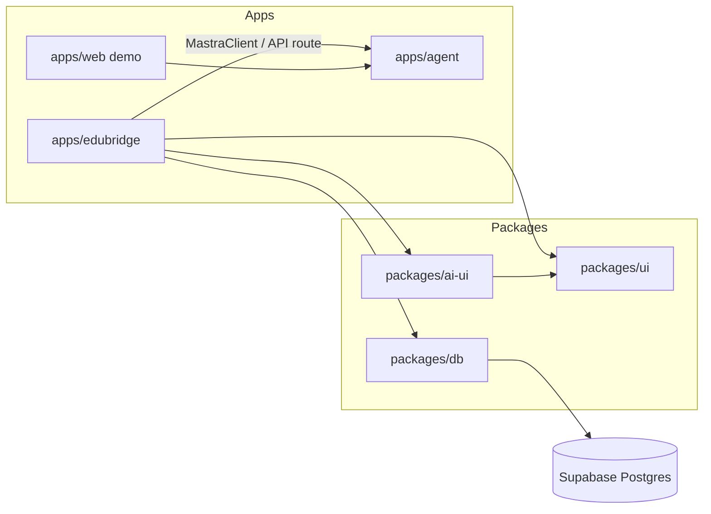

# Architecture

System-wide architecture documentation. Use this for cross-app concerns and platform integrations.

## Documents

| Document                                                               | Scope                                                                                     |
| ---------------------------------------------------------------------- | ----------------------------------------------------------------------------------------- |
| [Data Access](./data-access.md)                                        | Drizzle over Supabase Postgres, tenant transactions, RLS layering (ADR-004)               |
| [Multi-tenancy](./multi-tenancy.md)                                    | School schema, relationships, RLS boundary, platform-owner separation                     |
| [Platform Boundaries](./platform-boundaries.md)                        | Three authz contexts, folder map, URL surface, Phase 0 vs 6 split                         |
| [Support Access](./support-access.md)                                  | School-approved JIT support grants, scopes, audit, RLS contract (Phase 6)                 |
| [Authentication](./auth/README.md)                                     | Auth folder: strategy, RBAC, family access, `features/auth/`, agent auth                  |
| [AI / RAG](./ai-rag.md)                                                | Mastra RAG with pgvector vs. SQL tools, tenant-filtered retrieval                         |
| [Agent Ecosystem](./agent-ecosystem.md)                                | Orchestrator + domain sub-agents: scoped tools, per-user memory, token-conservation rules |
| [Mobile App](./mobile-app.md)                                          | PWA + TWA; family (parent/student) surface via admission + DOB                            |
| [Monorepo](./monorepo.md)                                              | Turborepo + pnpm workspace layout, apps vs packages                                       |
| [AI Platform](./ai-platform.md)                                        | Mastra as a separate service, how `apps/web` connects                                     |
| [Mastra Web Connection](./mastra-web-connection.md)                    | `mastra-client.ts`, AI UI package layout, feedback 500 fix, phased plan                   |
| [Mastra Supabase Database](./mastra-supabase-database-architecture.md) | Production database setup with Supabase Postgres                                          |

## When to add here vs `docs/features/`

| Add to `architecture/`              | Add to `features/<name>/`               |
| ----------------------------------- | --------------------------------------- |
| Mastra server placement in monorepo | Customer feedback summarization UI flow |
| Auth strategy across apps           | Feature-specific API routes             |
| Shared database / storage choices   | Tool implementation for one agent       |
| Deployment topology                 | User-facing feature requirements        |

## Diagram (target state)

