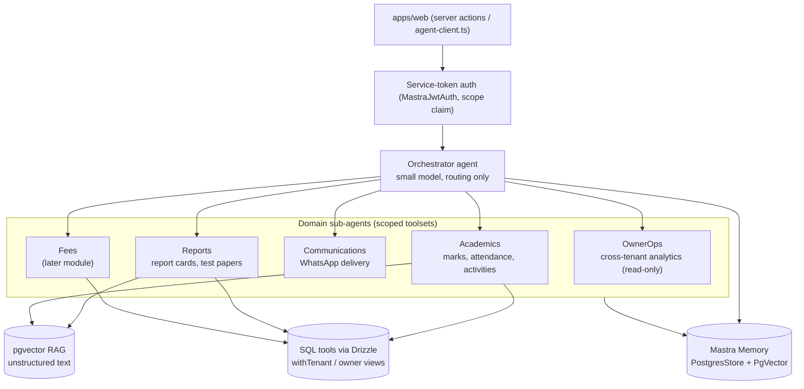

# Agent Ecosystem — Orchestrator + Domain Sub-Agents

> Target shape of EduBridge's AI layer: one **orchestrator agent** that receives every request, routes it to a **domain sub-agent** with a narrow, scoped toolset, all behind the [agent-auth](./auth/agent-auth.md) service-token layer, with per-user memory and aggressive token conservation. Built entirely on Mastra in `apps/agent`.

This doc is the map; phases implement slices of it (Phase 2 ships the first two workflows with the same discipline).

## Design goals

1. **Scope** — a sub-agent can only touch its domain's tools; tools are tenant- and role-scoped by construction (they execute inside `withTenant`).
2. **Memory** — conversations and useful facts persist per user (and per parent thread), so follow-ups don't re-ask or re-fetch.
3. **Token economy** — the platform owner and schools should get maximum value per token: cheap models for routing, SQL over RAG for numbers, cached summaries, bounded retrieval.
4. **Owner leverage** — the platform owner gets cross-tenant read-only analytics through a dedicated agent surface, without breaking tenant isolation for anyone else.

## Topology

## Components

### Orchestrator (router)

- Receives every user-facing request (dashboard "ask", parent Q&A, owner console queries).
- Runs a **small, cheap model** (Haiku/Flash tier) whose only job: classify intent → pick sub-agent (+ extract obvious entities like student name, class).
- **Never** calls data tools itself; it only routes and then returns the sub-agent's answer. Keeps routing cost near-zero.

### Domain sub-agents

Each sub-agent is a Mastra `Agent` with instructions, a model sized to the task, and **only its own tools** registered:

| Sub-agent | Domain | Example tools | Phase |
|-----------|--------|---------------|-------|
| Academics | marks, attendance, activities | `getStudentAverages`, `getAttendanceTrend`, `getClassComparison` | 2 |
| Reports | report cards, test papers | `getTermMarks`, `draftCommentary`, `getQuestionBank` | 3–4 |
| Communications | WhatsApp delivery | `sendWhatsAppReport`, `renderTemplate` | 2 |
| Fees | collection, expenses | `getFeeStatus`, `getCollectionSummary` | later |
| OwnerOps | platform analytics | `getSchoolFunnel`, `getPlanDistribution`, `getModuleAdoption` | 5 |

Deterministic automations (summary generation, change detection) stay **workflows**, not conversational agents — sub-agents exist for interactive ask/follow-up scenarios.

### Scoping & authentication

- Every call from `apps/web` carries the HMAC-signed service token ([agent-auth.md](./auth/agent-auth.md)) with `sub`, `school_id`, `role`, `scope`.
- The `scope` claim names the sub-agent/workflow (`summary.generate`, `reports.share`, `parent.qa`, `owner.analytics`); the server rejects calls where the route's scope doesn't match the token.
- SQL tools execute inside `withTenant` with the token's claims → RLS enforces tenant isolation; role checks happen before the call in `apps/web` (`assertRole`).
- **OwnerOps is the one cross-tenant surface**: it only queries the dedicated owner SQL views (Phase 5, `security definer` aggregates) and is read-only by construction — no tool exists that writes cross-tenant.

### Memory

Mastra Memory with the `@mastra/pg` adapter (verified against Mastra docs):

- **`PostgresStore`** — conversation threads/messages in our Supabase Postgres (no new infra).
- **`PgVector`** — semantic recall over past messages, **resource-scoped per user**: set `MASTRA_RESOURCE_ID_KEY` so recall never leaks across users (let alone tenants).
- Memory stores **conversational context**, never a copy of school records — domain data stays in tenant tables and is fetched fresh by tools (otherwise we cache stale marks and pay tokens to be wrong).
- Working memory (small structured profile per user, e.g. "class teacher of 7B") reduces repeated context in system prompts.

### Token-conservation rules (apply everywhere)

1. **SQL over RAG for numbers** — aggregates are exact, cheap, and index-backed; embeddings only for commentary/policies/descriptions ([ai-rag.md](./ai-rag.md)).
2. **Summary caching by data hash** (Phase 2 rule) — if the underlying marks/attendance haven't changed, serve the stored summary, don't regenerate.
3. **Small router, right-sized workers** — Haiku/Flash for routing and classification; Sonnet only where prose quality matters (report commentary, parent answers).
4. **Bounded retrieval** — `topK` ≤ 3–5 on vector search; tools return compact projections (only fields the prompt needs), never full rows.
5. **Template-first messaging** — WhatsApp messages are templates with variables, not per-message LLM generation.
6. **Thread hygiene** — long parent threads are periodically compressed to a working-memory summary instead of replaying full history.

## Rollout mapping

| Phase | Ecosystem slice shipped |
|-------|------------------------|
| 2 | Service-token auth; Academics + Communications workflows (summary, WhatsApp); `PostgresStore` threads; summary caching |
| 3–4 | Reports sub-agent tools (commentary, question bank) |
| 5 | OwnerOps sub-agent on owner views; scope claims per module |
| Later | Orchestrator routing for parent-app Q&A; Fees sub-agent with the fees module |

The orchestrator is deliberately last: with one or two sub-agents, routing is a `switch` on the caller's intent; the LLM router earns its cost when 4+ sub-agents exist.

## Non-goals

- No autonomous cross-step agents that write school data — agents draft (commentary, papers), humans approve. **Agents never write tenant records directly.**
- No multi-tenant reasoning for school users — a school can only ever see its own data through any agent path.
- No fine-tuning / model training in-house (provider models + prompt/RAG are enough).

## References

- [agent-auth.md](./auth/agent-auth.md) — service tokens, MastraJwtAuth, scope claims
- [ai-platform.md](./ai-platform.md) — process boundary, Coolify host, env split
- [ai-rag.md](./ai-rag.md) — SQL-tools vs RAG split, pgvector setup
- [Mastra memory docs](https://mastra.ai/docs/memory/overview) · [Mastra agents](https://mastra.ai/docs/agents/overview)
- Phase files: [phase-2](../roadmap/phase-2-ai-integration.md), [phase-5](../roadmap/phase-5-timetable-maker.md), [phase-6](../roadmap/phase-6-platform-growth.md)
