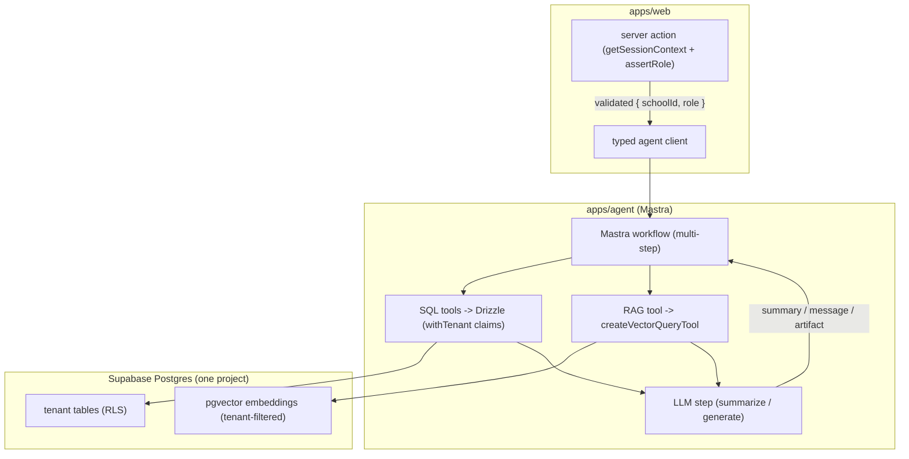

# AI / RAG Architecture — Mastra over Supabase pgvector

> How EduBridge's AI features (Phase 2+) retrieve school data: **structured data via Drizzle SQL tools, unstructured text via RAG with pgvector in the same Supabase Postgres**. This doc is the plan for the "AI agent reads from the database" phase. Verified against Mastra's official docs (August 2026).

## The key design split: SQL tools vs. RAG

Not everything belongs in a vector store. Choosing the right retrieval path per data type is what keeps answers accurate and costs low:

| Data | Retrieval path | Why |
|------|----------------|-----|
| Marks, attendance %, assessment totals, class rosters | **Drizzle SQL tools** (Mastra tools that run typed queries via `packages/db`) | Deterministic numbers — a vector search returning "similar" marks is a bug, not a feature |
| Activity notes, teacher remarks, observations, circulars, syllabus documents, uploaded files | **RAG (pgvector)** | Unstructured text; semantic search finds relevant passages an exact SQL match can't |
| Report summaries, report card commentary, test questions | **Generation** (LLM step in a Mastra workflow) fed by the two paths above | Synthesis, not retrieval |

Rule of thumb for agents working in `apps/agent`: **if the answer is a number or a row, use the SQL tool; if the answer is a passage, use RAG.**

## Architecture



Everything runs inside one Supabase Postgres project — pgvector is a Postgres extension, so embeddings live next to the relational data with the same backup, tenancy, and ops story. No separate vector database (Pinecone/Qdrant) to pay for or keep in sync.

## Vector store setup (verified API shape)

Enable pgvector in Supabase (`create extension if not exists vector;` in a migration), then in `apps/agent`:

```typescript
import { Mastra } from "@mastra/core";
import { PostgresStore, PgVector } from "@mastra/pg";

export const mastra = new Mastra({
  storage: new PostgresStore({
    id: "edubridge-storage",
    connectionString: process.env.DATABASE_URL!,
  }),
  vectors: {
    schoolKnowledge: new PgVector({
      id: "school-knowledge",
      connectionString: process.env.DATABASE_URL!,
    }),
  },
});

// One-time / migration-time index creation (HNSW for fast approximate search)
await mastra.vectors.schoolKnowledge.createIndex({
  indexName: "activity_notes",        // letters/numbers/underscores only — no hyphens
  dimension: 1536,                    // must match the embedding model
  indexConfig: { type: "hnsw" },
});
```

## Embedding pipeline (ingestion)

Runs when unstructured content is created/updated (activity note saved, circular uploaded). Implemented as a Mastra workflow in `apps/agent`, triggered from `apps/web` server actions (or a DB webhook later):

```typescript
import { MDocument } from "@mastra/rag";
import { embedMany } from "ai";

// 1. Chunk (MDocument handles strategies: recursive, markdown, etc.)
const doc = MDocument.fromText(rawText);
const chunks = await doc.chunk({ strategy: "recursive", size: 512, overlap: 50 });

// 2. Embed (embedding model pinned in agent config; text-embedding-3-small class)
const { embeddings } = await embedMany({
  model: embeddingModel,
  values: chunks.map((c) => c.text),
});

// 3. Upsert WITH TENANT METADATA — this is the isolation mechanism
await mastra.vectors.schoolKnowledge.upsert({
  indexName: "activity_notes",
  vectors: embeddings,
  metadata: chunks.map((c) => ({
    text: c.text,
    school_id: schoolId,      // every vector carries the tenant
    source_type: "activity",  // activity | remark | circular | syllabus
    source_id: sourceId,      // id of the originating row (for updates/deletes)
  })),
});
```

### Tenant isolation in the vector store (critical)

pgvector rows do **not** go through our table RLS automatically. Isolation is enforced two ways:

1. **Metadata filter on every query** (below) — `school_id` is mandatory in the filter; the agent receives it only from the validated context passed by `apps/web`, never from user input.
2. **Defense in depth (optional, recommended at scale):** keep vectors in a dedicated Postgres schema (`vectors`) with its own RLS policies keyed on a metadata/owner column, so even a missing filter can't cross tenants.

## Retrieval (query time)

```typescript
import { createVectorQueryTool } from "@mastra/rag";

const schoolKnowledgeTool = createVectorQueryTool({
  vectorStoreName: "schoolKnowledge",
  indexName: "activity_notes",
  model: embeddingModel,
  // pgvector tuning knobs: ef / probes, minScore
});

// Inside a workflow step — ALWAYS filtered by tenant:
const results = await mastra.vectors.schoolKnowledge.query({
  indexName: "activity_notes",
  queryVector: queryEmbedding,
  topK: 5,
  filter: { school_id: { $eq: ctx.schoolId } },   // non-negotiable
});
```

The agent/workflow then feeds retrieved chunks + SQL-tool facts into the LLM step with the same "no invented data" guardrails as Phase 2 summarization.

## Phase mapping (how this lands incrementally)

| Phase | RAG usage |
|-------|-----------|
| 2 | **SQL tools only** for summarization (marks/attendance are structured). RAG infrastructure set up (pgvector extension, index, ingestion for activity notes) but retrieval limited to notes/remarks. |
| 3 | Report card commentary retrieves the student's activity notes + remarks via RAG, combines with SQL marks. |
| 4 | Syllabus/question-bank documents embedded; AI question generation retrieves relevant syllabus chunks as grounding context. |
| 5 | Not user-facing RAG; owner console stays SQL/analytics. |

This is why Phase 2 builds the pipeline even though its headline feature (summaries) is mostly SQL-driven: Phase 3 and 4 depend on it.

## SQL tools (the other half of retrieval)

Mastra tools in `apps/agent/src/mastra/tools/` wrap Drizzle queries from `packages/db`. Each tool receives the validated tenant context (`{ schoolId, role }`) from the workflow input and queries under `withTenant` — the exact same pattern as web server actions, so the agent can never see another school's rows:

```typescript
// apps/agent/src/mastra/tools/get-student-marks.ts (shape)
import { createTool } from "@mastra/core/tools";
import { z } from "zod";
import { withTenant } from "@repo/db/rls";
import { marks } from "@repo/db/schema";
import { eq, and } from "drizzle-orm";

export const getStudentMarks = createTool({
  id: "get-student-marks",
  description: "Get a student's marks for the current term",
  inputSchema: z.object({ studentId: z.string(), schoolId: z.string(), userId: z.string() }),
  execute: async ({ context }) =>
    withTenant(
      { sub: context.userId, school_id: context.schoolId, role: "system" },
      (tx) => tx.select().from(marks).where(and(
        eq(marks.studentId, context.studentId),
        eq(marks.schoolId, context.schoolId),
      ))
    ),
});
```

## Operational notes

- **Embedding model choice:** pin one in `apps/agent` config (dimension must match the index — 1536 for text-embedding-3-small class). Changing models later means re-embedding everything; record the choice in an ADR when Phase 2 starts.
- **Re-embedding on edit:** ingestion is keyed by `source_id` — update/delete vectors when the source row changes (workflow step), otherwise summaries go stale.
- **Cost guardrails:** chunk size 512 + overlap 50, `topK` ≤ 5, `minScore` set — small schools, small corpora; these defaults keep both latency and token spend low.
- **Observability:** Mastra traces each workflow step (retrieve → generate → deliver) — use them to catch cross-tenant filter regressions in review.
- **Verify APIs before coding:** Mastra evolves fast — when implementing, check the embedded docs in `node_modules/@mastra/*/dist/docs/` (per the `mastra` skill) rather than trusting this doc's code shapes verbatim.

## References

- [Mastra RAG overview](https://mastra.ai/docs/rag/overview) · [vector databases](https://mastra.ai/docs/rag/vector-databases) · [PgVector reference](https://mastra.ai/reference/vectors/pg)
- [pgvector](https://github.com/pgvector/pgvector) on Supabase Postgres
- [data-access.md](./data-access.md) — `withTenant`, RLS claims
- [phase-2-ai-integration.md](../roadmap/phase-2-ai-integration.md) — delivery milestones
- `.agents/skills/mastra` — embedded-docs workflow for current API verification
