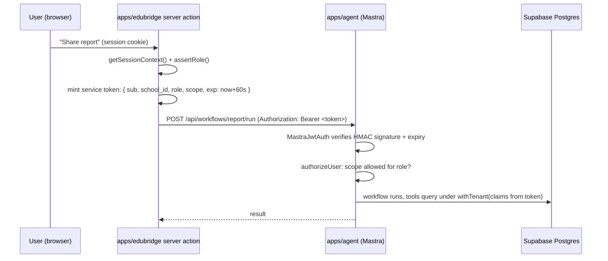

# AI Agent Authentication — `apps/edubridge` ↔ `apps/agent`

> How the Mastra service trusts requests. The agent never sees user sessions or raw tenant claims — it only accepts **short-lived, HMAC-signed service tokens minted by `apps/edubridge` after full session + role validation**, verified natively by Mastra's JWT auth provider. Low cost today (one shared secret), swappable later (composite/provider auth) without touching workflows.

## The threat model (why a layer is needed)

`apps/agent` runs Mastra workflows with powerful tools: Drizzle queries across tenant tables, LLM calls that cost money, WhatsApp delivery. If the agent trusted client-supplied `{ schoolId, role }` directly, any caller could impersonate any tenant. And if the agent had no auth at all, anyone reaching its port could run LLM workflows on our bill. Both are unacceptable — so all authorization is decided in `apps/edubridge`, and the agent verifies **proof** of that decision, not the claim itself.

## Design: mint-and-verify



Rules that make this safe:

1. **Token is minted only after** `getSessionContext()` + `assertRole()` succeed — the agent never re-implements user auth. Never forward Supabase cookies to Mastra.
2. **Short TTL (60 seconds)** — a leaked token is useless almost immediately; no refresh flow needed for server-to-server calls.
3. **Tenant context travels inside the signature** — tampering with `school_id` invalidates the token.
4. **Scope claim** limits what the token may do (`scope: "workflow:report-share"`), so a token minted for sharing can't run question generation.

## Implementation (verified against Mastra docs, August 2026)

Mastra has native server auth via `server.auth` — use the built-in JWT provider (`MastraJwtAuth`, HMAC-signed) rather than writing a custom provider:

```typescript
// apps/agent/src/mastra/index.ts
import { Mastra } from "@mastra/core";
import { MastraJwtAuth } from "@mastra/auth";

export const mastra = new Mastra({
  server: {
    auth: new MastraJwtAuth({
      secret: process.env.AGENT_SERVICE_SECRET!,   // shared with apps/web (server-only env)
      mapUserToResourceId: (user) => user.sub,     // memory/thread scoping per user
    }),
  },
});
```

```typescript
// apps/web/lib/agent-client.ts — mint + call (server-only)
import { SignJWT } from "jose";

const secret = new TextEncoder().encode(process.env.AGENT_SERVICE_SECRET!);

export async function callAgentWorkflow(
  ctx: SessionContext,                       // already validated by getSessionContext()
  workflow: string,
  scope: string,
  input: unknown,
) {
  const token = await new SignJWT({
    sub: ctx.userId,
    school_id: ctx.schoolId,
    role: ctx.role,
    scope,
  })
    .setProtectedHeader({ alg: "HS256" })
    .setIssuedAt()
    .setExpirationTime("60s")
    .sign(secret);

  const res = await fetch(`${process.env.MASTRA_API_URL}/api/workflows/${workflow}/run`, {
    method: "POST",
    headers: { Authorization: `Bearer ${token}`, "Content-Type": "application/json" },
    body: JSON.stringify({ input }),
  });
  if (!res.ok) throw new Error(`Agent call failed: ${res.status}`);
  return res.json();
}
```

Inside workflows/tools, the tenant claims come from the verified token (available on the request context) — and every DB access still goes through `withTenant()` with those claims, so Postgres RLS remains the backstop even if token validation had a bug.

### Defense in depth options (add as needed)

| Measure | When to add | Cost |
|---------|-------------|------|
| **Network isolation** — agent not publicly routable; web reaches it over private network/localhost | Production deploy (Phase 2) | Free (topology) |
| **Path protection** — mark all workflow routes `protected` in Mastra auth config; only health check `public` | Phase 2 setup | Free (config) |
| **Rate limiting** per `school_id` on LLM workflows (cost firewall) | Phase 2 | Small middleware |
| **Custom `MastraAuthProvider`** — extend base class with `authorizeUser` for per-scope rules beyond role checks | When scopes multiply (Phase 4) | Small |
| **Asymmetric keys (RS256) or composite auth** (Supabase user JWTs + service JWTs side by side) | If third-party callers ever hit the agent directly | Medium |

## Secret management

- `AGENT_SERVICE_SECRET` lives in **two** server-only places: `apps/web/.env.local` and `apps/agent/.env` — never in `NEXT_PUBLIC_*`, never at monorepo root, never committed.
- Rotation: secrets are versioned by deploy, not by user; rotate by deploying both apps. Short TTL means no user-visible disruption.
- Studio (Mastra's UI on :4111) must also be auth-protected in any deployed environment (Studio auth is supported for the JWT provider) — locally it's fine open on localhost.

## What the agent does NOT do

- No user login, no cookies, no sessions — it is a service, not an identity system.
- No direct browser calls. Browsers only ever talk to `apps/web`; the agent is unreachable from client code.
- No trust in request bodies for tenant context — body carries business input only; identity comes from the verified token.

## References

- [Mastra server auth](https://mastra.ai/docs/server/auth) · [JWT provider](https://mastra.ai/docs/server/auth/jwt) · [custom provider](https://mastra.ai/docs/server/auth/custom-auth-provider) · [middleware](https://mastra.ai/docs/server/middleware)
- [ai-rag.md](../ai-rag.md) — how authenticated workflows use SQL tools and RAG
- [rbac-model.md](./rbac-model.md) — what the `role` claim means
- Verify API shapes against `node_modules/@mastra/*/dist/docs/` when implementing (per the `mastra` skill)
