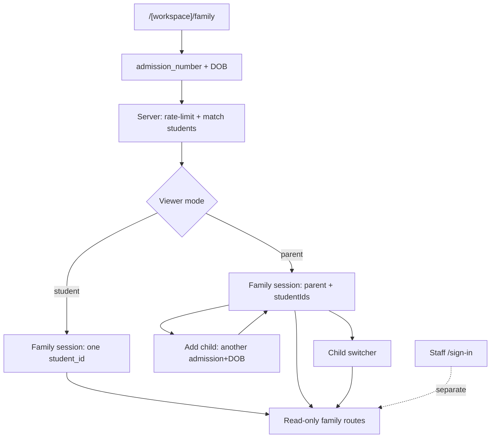

# Family access — admission number + DOB (option B)

> Canonical architecture for **parents and students** opening a **read-only, mobile-first** surface. Staff password / invite / domain-join stay separate and must not be broken by this path.

**Implement:** Phase 1 (needs `students` + `parent_links`). **Documented:** Phase 0 alignment.  
**Surface:** `/[workspace]/family` (default).  
**PWA / mobile:** [mobile-app.md](../mobile-app.md).

## Wayfinder — destination and decisions

### Destination

Parents and students unlock a read-only family session with **admission number + student DOB**; parents with multiple children use **one session + child switcher**; **admission number** is the school-scoped student key app-wide; staff auth remains unchanged.

### Decisions so far

| Decision | Answer |
|----------|--------|
| Who uses admission + DOB? | **Option B** — both parents/guardians and students |
| Mass student passwords? | **No** — no thousands of Supabase password users |
| Parent multi-child | Parent wrapper: verify first child → **Add child** with another admission+DOB → switcher |
| Student key (human) | `(school_id, admission_number)` unique; UUID remains internal FK |
| Entry URL | `/[workspace]/family` |
| When to build UI/schema | Phase 1 student dashboard |

### Out of scope (this map)

- Building family UI in Phase 0
- Replacing staff Supabase Auth
- WhatsApp / AI Q&A (later phases)

## Who enters how

| Actor | Entry | Sees |
|-------|--------|------|
| Student (any grade with a phone) | Own admission # + own DOB | Read-only self |
| Parent / guardian | Any child’s admission # + that child’s DOB | Read-only; then Add child + switcher |
| Staff / teacher / admin | `/sign-in`, invite, domain join | Full staff workspace — **not** this path |

**Invite is not for mass students/parents.** Invite remains for staff (and rare edge cases). Family read access is admission + DOB only.

## Flow

## Admission number as the student key

- Unique per school: `(school_id, admission_number)`.
- Human-facing identifier across modules (dashboard, reports, support).
- Internal FKs still use `students.id` (UUID).
- DOB lives on `students` (Phase 1); never trusted from the client alone.

## Family session (not password Auth per student)

1. Server verifies admission + DOB against tenant `students`.
2. Issues a **short-lived signed family session cookie** with claims:
   - `schoolId`
   - `viewer: "student" | "parent"`
   - `studentIds[]`
   - `activeStudentId`
3. Family routes/actions are **read-only** (SELECT only).
4. Optional later escalation: bind a real `parent` `school_members` row after phone OTP (per-school opt-in).

## Parent wrapper (multi-child)

1. Choose “I am a parent/guardian” → enter child A admission + DOB → session `[A]`.
2. **Add another child** → enter B’s admission + DOB → append B; persist `parent_links` (Phase 1).
3. Child switcher — one session, no second login.
4. New device: re-verify any linked child’s admission + DOB (or later phone OTP).

## Staff auth must stay unbroken

- Family under `/[workspace]/family/...` — not `/sign-in`.
- `proxy.ts`: accept family cookie **or** staff session; staff membership checks never treat a family cookie as `school_members`.
- RLS for family path: Phase 1 student-scoped policies / server claims — never teacher/admin powers.

## Security floor

- Hard rate limit (IP + admission number).
- Generic error: “details don’t match” (no field hints).
- Audit log of attempts.
- Short session TTL; extend only via re-proof or Add-child proof.
- Mobile-first / PWA: [mobile-app.md](../mobile-app.md), [accessibility.md](../../design/accessibility.md).

## Local vs production

Same Supabase project and rules. Local: `localhost:3000/<slug>/family`. Production: workspace host + same path (ADR-006). No email required for family proof.

Staff invite testing remains in [auth-local-vs-prod.md](../../guides/auth-local-vs-prod.md).

## Related

- [feature-module.md](./feature-module.md) — auth feature layout
- [rbac-model.md](./rbac-model.md) — staff vs family grants
- [phase-1-student-dashboard-mvp.md](../../roadmap/phase-1-student-dashboard-mvp.md) — `students`, `parent_links`, UI
