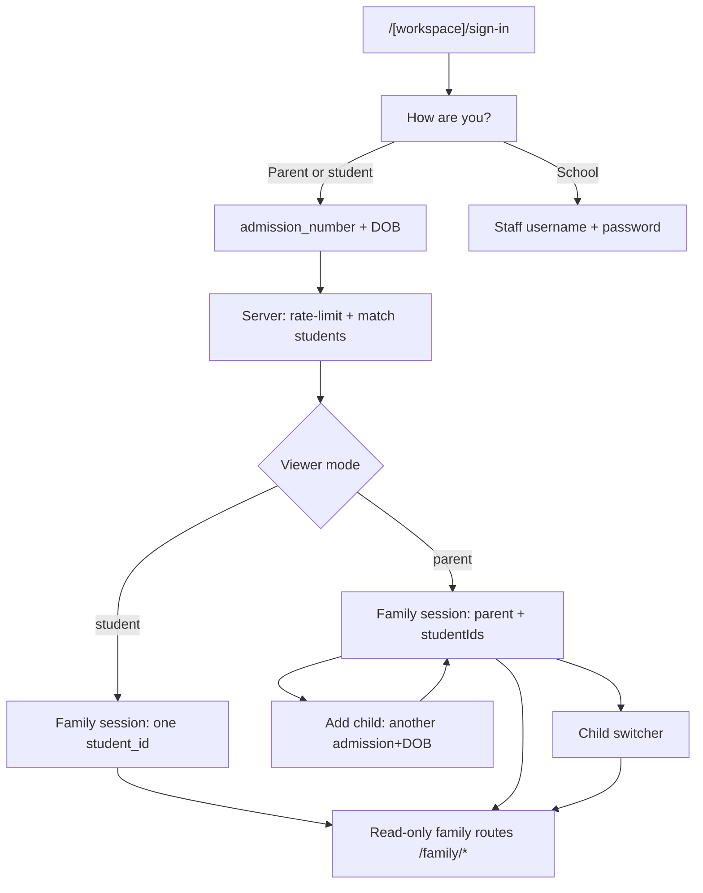

# Family access — admission number + DOB (option B)

> Canonical architecture for **parents and students** opening a **read-only, mobile-first** surface. Staff password / office create / domain-join stay separate and must not be broken by this path.

**Phase 0:** `/{slug}/sign-in` How are you? then admission + DOB (`?who=family`) + HMAC cookie `edubridge.family`.  
**Phase 1 Slice 1 (shipped):** `/{slug}/family/home` hub + Fees / Progress / Exams / Events under `/family/*`.  
**Phase 1 Slice 2 (shipped):** parent wrapper — `parent_links.family_id` sibling group, Add child, switcher (`0009_parent-links` migrated).  
**Phase 1 Slice 3 (in progress):** school `/students` class filter + attendance; family Progress/Exams/Events read those tables. Marks CRUD, charts, PWA still open.  
Checkboxes: [implementation-plan.md](../../features/student-dashboard/implementation-plan.md). Routes: [family-surface.md](./family-surface.md).  
**PWA / mobile:** [mobile-app.md](../mobile-app.md).

## Wayfinder — destination and decisions

### Destination

Parents and students unlock a read-only family session with **admission number + student DOB**; parents with multiple children use **one session + child switcher**; **admission number** is the school-scoped student key app-wide; staff auth remains unchanged.

Two-door table (canonical): [auth README](./README.md#two-doors-school-is-the-url). Local URLs:

| Door | Open |
|------|------|
| Public chooser | `localhost:3000/<slug>/sign-in` |
| Staff | `localhost:3000/<slug>/sign-in?who=school` |
| Family proof | `localhost:3000/<slug>/sign-in?who=family` |
| Family app | `localhost:3000/<slug>/family/home` |

### Decisions so far

| Decision | Answer |
|----------|--------|
| Who uses admission + DOB? | **Option B** — both parents/guardians and students |
| Mass student passwords? | **No** — no thousands of Supabase password users; no mass student/parent staff accounts |
| Parent multi-child | Parent wrapper: verify first child → **Add child** with another admission+DOB → switcher (Phase 1 UI) |
| Student key (human) | `(school_id, admission_number)` unique; UUID remains internal FK |
| Entry URL | `/[workspace]/sign-in` (How are you?; `?who=family` skips to the form) |
| Verify + cookie | `matchStudentForFamily` + `lib/tenancy/family-session.ts` |
| Form | `FamilySignInForm` at `/sign-in?who=family` |
| Family home | Slice 1 — `/{slug}/family/home` hub ([family-surface.md](./family-surface.md)) |
| Add child | Slice 2 — `/{slug}/family/add-child` (parent only) |

### Out of scope (this map)

- Student dashboard charts on the family surface (map: [family-surface.md](./family-surface.md))
- Replacing staff Supabase Auth
- WhatsApp / AI Q&A (later phases)

## Who enters how

| Actor | Entry | Sees |
|-------|--------|------|
| Student (any grade with a phone) | `/{slug}/sign-in?who=family` — own admission # + own DOB | Read-only self |
| Parent / guardian | `/{slug}/sign-in?who=family` — any child’s admission # + that child’s DOB | Read-only; Add child + switcher in Phase 1 |
| Staff / teacher / admin | `/{slug}/sign-in?who=school` (username + password) or global `/sign-in` (email + password) | Full staff workspace — **not** this path |

**Add member is not for mass students/parents.** Office create is for staff only (`provisionRoles` excludes `student` / `parent`). Family read access is admission + DOB only.

## Flow

Headless verify: `matchStudentForFamily({ schoolSlug, admissionNumber, dateOfBirth, ip })`. Form: `FamilySignInForm` → `familySignInAction` → cookie → redirect `/{slug}/family/home`.

1. Resolve `schools.slug` → `school_id` (URL slug only; never a client `schoolId`).
2. `SELECT` from `students` where `school_id` + `date_of_birth`, then match admission with hyphens/spaces ignored (`EBS2024006` = `EBS-2024-006`).
3. Hit → `{ studentId, schoolId }`. Miss → generic `"details don’t match"` (wrong DOB, unknown admission, other school — same copy).
4. Rate-limit key: **IP + admission + slug** (not IP alone — shared school WiFi).

`getDb()` is the privileged postgres role. Always constrain by `school_id` from the slug.

Seed checks (`pnpm --filter @repo/db test:family-match`): Pilot + `EBS-2024-006` + `2013-06-06` matches; wrong DOB generic miss; same admission on `oakwood-academy-bridge` misses.

## Admission number as the student key

- Unique per school: `(school_id, admission_number)`. Stored value can keep hyphens; family login ignores `-` and spaces.
- Human-facing identifier across modules (dashboard, reports, support).
- Internal FKs still use `students.id` (UUID).
- DOB lives on `students`; never trusted from the client alone.

## Family session (not password Auth per student)

Module: `apps/edubridge/lib/tenancy/family-session.ts` (HMAC helpers in `family-session-token.ts`). **Not** inside `getSessionContext`.

1. Server verifies admission + DOB against tenant `students`.
2. Issues a signed HttpOnly cookie `edubridge.family` (HMAC-SHA256, same *shape* as impersonation, different contract):
   - `schoolId`
   - `viewer: "student" | "parent"`
   - `studentIds[]` (cap 8)
   - `activeStudentId`
   - `familyId?` — opaque sibling group on **parent** sessions only (not an `auth.users` id)
   - `expiresAt`
3. Secret: `FAMILY_SESSION_SECRET` (separate from `IMPERSONATION_SECRET`). Required in production.
4. **Origin-aware Path (PWA-safe):**
   - Local / path-only: `Path=/{slug}/family` so Pilot and Oakwood do not share a cookie on localhost.
   - Production after rewrite: host is `{slug}.edubridge.app`, `Path=/family`. **Never** `Domain=.edubridge.app`.
   - Family cookie Path follows Host, not `NODE_ENV` ([workspace-urls.md](../workspace-urls.md)).
5. **TTL ~30 days** at sign-in. Reads do not rewrite the cookie (RSC-safe). Re-proof on a new device.
6. Every read re-checks payload `schoolId` against the URL slug’s school.
7. Family routes/actions are **read-only** (SELECT only). Hub UI (home + fees/progress/exams/events) is Slice 1; charts wait on Slice 3.
8. Optional later escalation: bind a real `parent` `school_members` row after phone OTP (per-school opt-in).

`getSessionContext` stays Supabase-only. A family cookie on Team/Fees is anonymous staff.

## Parent wrapper (multi-child)

There is **no parent `auth.users` row**. `parent_links` is a **sibling group**:

| Column | Meaning |
|--------|---------|
| `school_id` | Tenant |
| `family_id` | Opaque UUID stored on the cookie (`familyId`) |
| `student_id` | Linked child |

Unique `(school_id, family_id, student_id)`. Family writes use privileged `getDb()` (same as match). Staff later use RLS (`school_admin` write; members SELECT). Cap **8** children.

1. Choose “I am a parent/guardian” → enter child A admission + DOB → reuse the latest group that already contains A, or mint a `family_id` → cookie `[A]` + `familyId`.
2. **Add child** (`/{slug}/family/add-child`) → prove B’s admission + DOB → insert `parent_links` → append B; `activeStudentId` becomes B.
3. Child switcher when 2+ linked — still **one child on screen**. `studentId` must already be in `session.studentIds` (never from the URL alone).
4. Student viewer: no `parent_links`, no Add child (`/family/add-child` redirects home).
5. New device: re-verify any linked child’s admission + DOB (or later phone OTP). Admin CRUD on `parent_links` waits for staff `/students`.

## Staff auth must stay unbroken

- Family **pages** stay under `/[workspace]/family/...` so cookie Path works. Proof form lives on `/{slug}/sign-in?who=family`. Global `/sign-in` is staff-only.
- `proxy.ts`: allow `/{slug}/family` and `/{slug}/sign-in` without a Supabase user; staff workspace paths still require Supabase. Family cookie **does not** satisfy the staff branch. (`proxy.ts` is owned with the staff sign-in work.)
- `getSessionContext` never reads `edubridge.family`. Team/Fees keep `getSessionContext` + role gates.
- RLS for family path: Phase 1 student-scoped policies / server claims — never teacher/admin powers.

## Security floor

- Rate limit **IP + admission number + school slug** (not IP alone).
- Generic error: “details don’t match” (no field hints).
- Audit log of attempts (when we add family audit rows).
- ~30-day cookie at family sign-in; 8h hard expiry is wrong for a phone PWA.
- Admission + DOB is weak proof (printed on ID cards) — acceptable only because family is read-only + rate-limited. Never for fees write or staff.
- Mobile-first / PWA: [mobile-app.md](../mobile-app.md), [accessibility.md](../../design/accessibility.md). Do **not** store the family session in `localStorage`.

## Local vs production

Same Supabase project and rules. Local: `localhost:3000/<slug>/family` (cookie path `/{slug}/family`). Production after rewrite: `{slug}.edubridge.app` + `Path=/family` (ADR-006). No email required for family proof.

Staff office-create and domain-join testing remains in [auth-local-vs-prod.md](../../guides/auth-local-vs-prod.md).

## Related

- [feature-module.md](./feature-module.md) — auth feature layout
- [rbac-model.md](./rbac-model.md) — staff vs family grants
- [strategy.md](./strategy.md) — admission+DOB is the family cookie, not a Supabase method
- [phase-1-student-dashboard-mvp.md](../../roadmap/phase-1-student-dashboard-mvp.md) — family UI, `parent_links`
