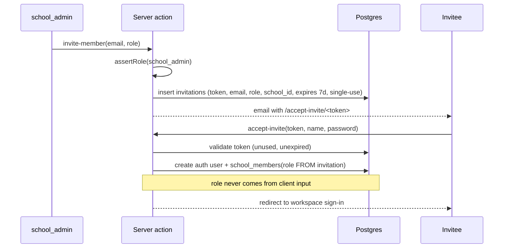

# The `features/auth/` Module — Implementation Blueprint

> How authentication is implemented as a feature module in `apps/web`, following the [feature-folder blueprint](../../guides/feature-folder-structure.md). This is the Phase 0 build spec for auth screens, actions, and flows.

## Module layout

```
apps/web/features/auth/
├── components/
│   ├── sign-in-form.tsx          # email + password, plus "email me a code" option
│   ├── otp-verify-form.tsx       # 6-digit OTP (email or phone)
│   ├── accept-invite-form.tsx    # set name + password (or OTP) via invite token
│   ├── invite-member-form.tsx    # admin: email + role -> send invitation
│   ├── passkey-settings.tsx      # register/remove passkeys (post-MVP)
│   ├── parent-sign-in-form.tsx   # admission no. + student DOB (family; Phase 1)
│   ├── add-child-form.tsx        # parent wrapper: extra admission+DOB (Phase 1)
│   └── user-menu.tsx             # profile, role badge, school switcher, sign out
├── actions/
│   ├── sign-in.ts                # password sign-in
│   ├── sign-in-otp.ts            # request email/phone OTP
│   ├── verify-otp.ts             # verify OTP code
│   ├── sign-out.ts
│   ├── invite-member.ts          # school_admin only
│   ├── accept-invite.ts          # creates school_members row server-side
│   ├── register-passkey.ts       # post-MVP
│   └── parent-sign-in.ts         # resolve admission no. + DOB -> session (rate-limited)
├── queries/
│   └── get-membership.ts         # bootstrap: user -> memberships (school switcher)
├── lib/
│   ├── supabase-server.ts        # @supabase/ssr server client (cookies)
│   ├── supabase-client.ts        # @supabase/ssr browser client
│   ├── schemas.ts                # zod: email, phone, OTP, invite payloads
│   └── redirects.ts              # role-aware post-login redirect logic
├── types.ts
├── index.ts                      # public surface
└── README.md                     # per blueprint (15-30 lines)
```

Route files stay thin and live outside the feature:

```
apps/web/app/
├── (auth)/
│   ├── sign-in/page.tsx          # renders <SignInForm/>
│   ├── verify-otp/page.tsx       # renders <OtpVerifyForm/>
│   └── accept-invite/[token]/page.tsx
├── auth/callback/route.ts        # code exchange (magic link / OAuth) — REQUIRED
└── [workspace]/settings/team/    # renders <InviteMemberForm/> (admin)
```

## Core patterns (from the nextjs-supabase-auth skill)

```typescript
// lib/supabase-server.ts
import { createServerClient } from "@supabase/ssr";
import { cookies } from "next/headers";

export async function createClient() {
  const cookieStore = await cookies();
  return createServerClient(
    process.env.NEXT_PUBLIC_SUPABASE_URL!,
    process.env.NEXT_PUBLIC_SUPABASE_ANON_KEY!,
    {
      cookies: {
        getAll: () => cookieStore.getAll(),
        setAll: (toSet) => toSet.forEach(({ name, value, options }) =>
          cookieStore.set(name, value, options)),
      },
    }
  );
}
```

```typescript
// actions/sign-in.ts
"use server";

import { revalidatePath } from "next/cache";
import { redirect } from "next/navigation";
import { createClient } from "../lib/supabase-server";

export async function signIn(formData: FormData) {
  const supabase = await createClient();
  const { error } = await supabase.auth.signInWithPassword({
    email: formData.get("email") as string,
    password: formData.get("password") as string,
  });
  if (error) return { error: error.message };   // generic message — no account enumeration

  revalidatePath("/", "layout");
  redirect(await resolvePostLoginDestination()); // role-aware, below
}
```

```typescript
// app/auth/callback/route.ts — required for magic links / OAuth code exchange
import { createClient } from "@/features/auth/lib/supabase-server";
import { NextResponse } from "next/server";

export async function GET(request: Request) {
  const { searchParams, origin } = new URL(request.url);
  const code = searchParams.get("code");
  if (code) {
    const supabase = await createClient();
    const { error } = await supabase.auth.exchangeCodeForSession(code);
    if (!error) return NextResponse.redirect(`${origin}${searchParams.get("next") ?? "/"}`);
  }
  return NextResponse.redirect(`${origin}/sign-in?error=auth`);
}
```

## Role-aware post-login redirect

After any successful sign-in, `resolvePostLoginDestination()` (in `lib/redirects.ts`):

1. Load the user's memberships (`queries/get-membership.ts`).
2. One membership → redirect straight to that workspace home (`/<slug>`).
3. Multiple → redirect to a workspace chooser (or last-used workspace from a cookie).
4. `platform_owner` claim present → offer console link (console itself re-verifies server-side).
5. Zero memberships → "awaiting invitation" screen (a user without membership sees nothing tenant-related).

## Middleware integration

`apps/web/middleware.ts` (root) handles two jobs in one pass:

1. **Session refresh** — `@supabase/ssr` cookie rotation on every request.
2. **Route protection** — unauthenticated requests to `/[workspace]/*` redirect to `/sign-in?next=<path>`; authenticated requests to `/(auth)` pages redirect to their destination.

Tenant membership checks stay in `getSessionContext()` per request (middleware only knows the session, not the slug→school resolution).

## Invitation flow (role granting — detail)



## Passkey UI (post-MVP)

- Registration lives in workspace profile settings (`passkey-settings.tsx`): "Enable fingerprint sign-in" → `auth.registerPasskey()` → list/remove enrolled passkeys.
- Sign-in page gets a "Sign in with fingerprint" button → `auth.signInWithPasskey()` (discoverable credentials — no email field needed).
- Retry UX around `webauthn_challenge_expired` (user took too long at the biometric prompt).

## Family access (admission number + DOB)

Canonical architecture: [family-access.md](./family-access.md). Parent app / PWA: [mobile-app.md](../mobile-app.md).

**Parents and students** (option B) enter at `/[workspace]/family` with **student admission number + student date of birth** — no password, no OTP for mass users. Safe only because the session is **read-only and data-minimal**:

- Server resolves admission + DOB to a `students` row, then issues a **family session cookie** (`viewer: student|parent`, `studentIds`, `activeStudentId`) — **not** thousands of Supabase password accounts.
- Parents: after first child, **Add child** with another admission+DOB; child switcher; persist `parent_links` in Phase 1.
- **Rate-limit hard** (per IP + per admission number), return a **generic** "details don't match" error, and log attempts.
- Family routes never get staff write powers; RLS / claims are student-scoped.
- Escalation (optional later): phone OTP → bind a real `parent` `school_members` row (per-school opt-in).

Staff invite / domain join stay on `/sign-in` and Team settings — do not route mass students through invites.

## Testing checklist

- [ ] Password sign-in/out, wrong-password error is generic
- [ ] Email OTP request/verify happy path + expired code
- [ ] Magic-link callback route exchanges code and redirects
- [ ] Middleware: unauthenticated `/[workspace]/*` redirects; session persists across refresh
- [ ] Invite: only `school_admin` can invite; token single-use; expired token rejected; membership created with invitation's role
- [ ] Multi-school user sees switcher; each workspace evaluates role independently
- [ ] All auth actions call `revalidatePath("/", "layout")`
- [ ] `pnpm lint && pnpm check-types` green
