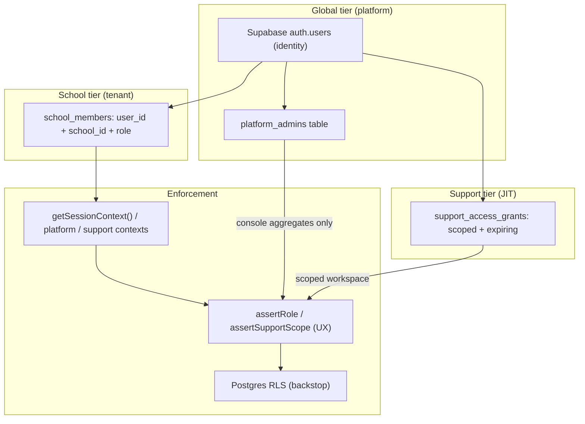

# RBAC Model — Role Separation Done Properly

> How EduBridge separates platform owner, school admin, teacher, staff, student, and parent. The rule: **Supabase Auth proves who you are; authorization context decides what you can do — and where.**

Canonical SaaS boundaries: [platform-boundaries.md](../platform-boundaries.md).
Support entry: [support-access.md](../support-access.md).

## Three authorization contexts (one identity)

One Supabase Auth identity per person. Do **not** run separate auth backends for
platform vs schools. Authorization is three independent contexts:

| Context | Source of truth | Surface |
|---------|-----------------|---------|
| Tenant | `school_members` | School workspace |
| Platform | `platform_admins` (auditable); claim cache optional | Owner console — billing/aggregates only |
| Support | Expiring `support_access_grants` (school-approved) | Temporary scoped workspace access |

- **Global tier:** the Supabase identity (email/phone/passkey login). One person = one `auth.users` row, regardless of how many schools they belong to.
- **School tier:** `school_members` rows attach that identity to a school with a role. The same person can be `teacher` in one school and `parent` in another.
- **Support tier (Phase 6):** time-boxed grants; never a substitute for membership.

## The school roles

| Role | Lives where | Can never |
|------|-------------|-----------|
| `platform_owner` | `platform_admins` (+ optional `app_metadata` cache), **never a `school_members` row** | Browse tenant data without a support grant; self-grant support; appear as a school member |
| `school_admin` | `school_members` | Manage other schools; access platform console |
| `coordinator` | `school_members` | Grant admin/coordinator roles; impersonate; touch fees — delegated people-management only ([admin-controls.md](./admin-controls.md)) |
| `accountant` | `school_members` | See fees outside their school; manage members |
| `teacher` | `school_members` | Act outside assigned class-subjects; publish report cards |
| `staff` | `school_members` | Enter marks; see non-delegated classes |
| `student` | `school_members` | See anyone else's data |
| `parent` | `school_members` | See children they aren't linked to; request shares to arbitrary numbers |

Privileged actions (invite, activate, deactivate, impersonate, role change)
route through the central capability map in
`apps/edubridge/lib/auth/capabilities.ts` — see
[admin-controls.md](./admin-controls.md) for the full matrix.

Full capability matrix: [docs/roadmap/README.md](../../roadmap/README.md#roles-rbac) and per-phase RBAC tables.

## Why platform_owner is not a membership

Three reasons:

1. **Blast radius.** If owner access were just "a member with a special role" in some school, any tenant-scoped bug could leak owner power into a workspace. Platform context is checked only by the console route group / host.
2. **RLS simplicity.** Tenant policies match `school_members` (and later scoped support helpers) — no superuser bypass on every table. The owner console reads through dedicated `security definer` views — the only sanctioned **aggregate** cross-tenant path.
3. **Auditability.** Console actions attribute to `platform_admins`; workspace support attributes to grants + audit rows ([support-access.md](../support-access.md)).

Implementation: **start with `platform_admins`** (set via service-role, never user-editable). Optional `app_metadata` / access-token hook later if lookup becomes hot — table remains source of truth.

## Claims lifecycle (every request)

1. `proxy.ts` refreshes/verifies the Supabase session (`getUser()` — never `getSession()`). Host rewrite may map subdomain → workspace slug ([ADR-006](../../decisions/ADR-006-workspace-subdomains.md)).
2. Tenant pages: `getSessionContext(schoolSlug)` runs the **bootstrap query**: resolve slug → school, verify `school_members` → `{ userId, schoolId, role }`. This is the one ordinary query allowed outside `withTenant`. Platform and support contexts use their own documented lookups.
3. `assertRole(ctx, allowed)` (or support scope asserts) gates the action/page (friendly 403).
4. `withTenant({ sub, school_id, role }, tx => ...)` sets transaction-scoped claims; RLS rejects anything the policy wouldn't allow.

Each layer independently stops misuse; no layer trusts the previous one blindly — RLS re-validates membership against `school_members` rather than trusting the `role` claim.

## Multi-school users

A parent with children in two schools, or a teacher who is also a parent, holds multiple `school_members` rows. Rules:

- Workspace URL selects the school context — there is no "merged view" of schools.
- The profile menu offers a **school switcher** listing the user's memberships; switching navigates to the other workspace's home.
- Role is always evaluated per workspace, never globally (except `platform_owner`).

## Privileged-role hardening

- `school_admin` and `platform_owner` are MFA (TOTP) eligible — enforced for owner in Phase 6, recommended for admins earlier.
- Role changes (invite with role, promote, demote, remove) are admin-only mutations with audit rows (`created_by`/`updated_by` pattern).
- Downgrade paths matter: removing a membership must immediately invalidate access — RLS reads live membership, so deletion takes effect on the next request with no session revocation needed.

## Membership grants (how roles are granted)

Two paths. Both end in a `school_members` row created **server-side**. Role never
comes from untrusted client input as the sole authority.

### 1. Invite (any school role)

- `school_admin` creates an invitation (email + role) → single-use tokenized link
  (expiry: 7 days) → invitee sets password → server creates `school_members`
  from the invitation record. Coordinators may invite non-admin roles
  ([admin-controls.md](./admin-controls.md)).

### 2. Domain join → admin activate (teacher / staff)

When a school is registered with `official_email_domain` (e.g. `dps.edu.in`):

1. A user signs up / signs in with an email on that domain (consumer inboxes like
   `gmail.com` are rejected for this path).
2. Server matches email domain → school and upserts a **pending**
   `membership_requests` row. No workspace access yet (not in `school_members`).
3. User lands on an “awaiting activation” screen.
4. `school_admin` reviews the queue on the team dashboard, **activates** with an
   explicit role (`teacher` | `staff` | optionally other school roles except
   inventing `platform_owner`). That write creates `school_members`.

Domain match alone must **never** auto-grant `school_admin` or any active
membership. **Students and parents do not use invite or domain join for mass
access** — they use admission number + DOB on the family surface
([family-access.md](./family-access.md)). Invite remains for staff (and rare
edge cases only).

Public registration that **creates a school** (Phase 6) always yields
`school_admin` for the registrant — separate from domain join and family access.
