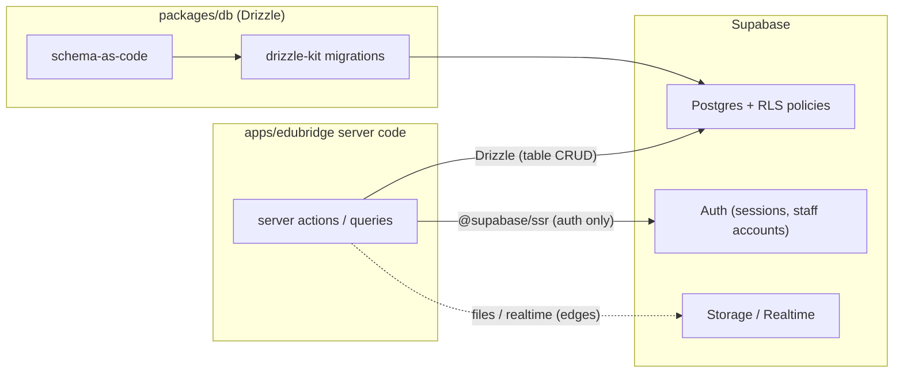
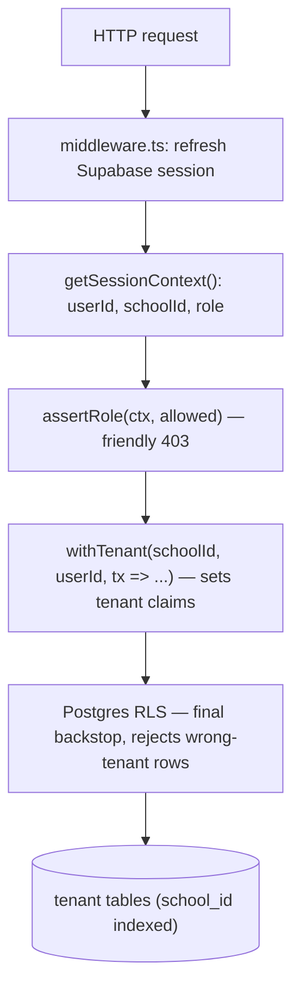

# Data Access Strategy — Drizzle over Supabase Postgres

> Decision record summary in [ADR-004](../decisions/ADR-004-drizzle-data-access.md). This document is the working reference: connection setup, authentication, RBAC, and the tenant-transaction pattern every module uses.

## The stack

| Concern                   | Tool                                            | Why                                                                   |
| ------------------------- | ----------------------------------------------- | --------------------------------------------------------------------- |
| Database                  | Supabase Postgres (one shared project)          | Managed Postgres, RLS, auth-adjacent                                  |
| Schema + migrations       | **Drizzle ORM** (`packages/db`) + `drizzle-kit` | Type-safe schema-as-code, shared by `apps/edubridge` and `apps/agent` |
| Table CRUD in app code    | Drizzle queries only                            | One query style, compile-time safety, portable SQL                    |
| Tenant isolation backstop | **RLS policies in SQL migrations**              | Enforced by Postgres even if app code has a bug                       |
| Authentication            | **Supabase Auth** via `@supabase/ssr`           | Session cookies, email/password + magic link, office-created staff    |
| Storage / realtime        | Supabase client                                 | Used at the edges only, never for table CRUD                          |

## Why Drizzle + Supabase (and not the alternatives)

Your concern was right: raw SQL strings scattered through app code become a maintenance bottleneck, and an ORM gives type safety and a single source of truth. But the choice of ORM matters:

- **Prisma** fights Supabase's model. Prisma runs its own query engine and connects as one role; making it impersonate the tenant for RLS requires middleware/extensions that are fragile with Next.js SSR auth flows. It also adds a heavy runtime and a second schema language.
- **Supabase JS client everywhere** (no ORM) keeps RLS integration perfect, but table access becomes stringly-typed filter chains with types that drift from the schema unless constantly regenerated. Fine for scripts, weak as the primary app data layer.
- **Drizzle** is a thin TypeScript SQL layer: schema-as-code, generated types, real SQL semantics, and — critically — it can set the **tenant context per transaction**, so Postgres RLS applies to every query in that transaction. Swapping the Postgres host later (Supabase → Neon/RDS/self-hosted) is a connection-string change.

### Direct comparison: Drizzle vs. Supabase client for table access

| Concern                                                       | Direct Supabase JS client (no ORM)                                                       | Drizzle + `withTenant` (chosen)                                                                 |
| ------------------------------------------------------------- | ---------------------------------------------------------------------------------------- | ----------------------------------------------------------------------------------------------- |
| Type safety                                                   | Types generated separately (`supabase gen types`), drift risk between schema and usage   | Schema-as-code IS the type source; drift fails `pnpm check-types`                               |
| Query style                                                   | Stringly-typed filter chains (`.eq("school_id", id)`) — easy to forget the tenant filter | Typed SQL semantics; tenant filter enforced by the transaction wrapper, not per-call discipline |
| RLS integration                                               | Perfect (user JWT flows through)                                                         | Equal — claims injected per transaction via `set_config`                                        |
| Complex queries (joins, aggregations for report cards/charts) | Verbose, multiple round-trips or RPC functions                                           | First-class joins/aggregations in one typed query                                               |
| Shared between web + agent                                    | Duplicated query strings                                                                 | One `packages/db` import                                                                        |
| Refactoring safety                                            | Renames break at runtime                                                                 | Renames break at compile time                                                                   |
| Portability off Supabase                                      | Queries tied to PostgREST semantics                                                      | Standard Postgres SQL — change `DATABASE_URL` and go                                            |

**Bottom line:** the Supabase client is excellent at the edges (auth, storage, realtime) and weak as the primary table-access layer at our scale of relational complexity. Drizzle gives ORM ergonomics without fighting RLS — which is precisely the failure mode that rules out Prisma.

The hybrid split is deliberate and fixed:



## RBAC layering — defense in depth



Every layer can stop a bad request; no single layer is trusted alone.

## 1. Database connection (server-only)

`packages/db` is the single source of truth for schema and the connection factory:

```typescript
// packages/db/src/client.ts
import { drizzle } from "drizzle-orm/postgres-js";
import postgres from "postgres";
import * as schema from "./schema";

// Server-only. DATABASE_URL points at Supabase's pooler (transaction mode).
const client = postgres(process.env.DATABASE_URL!, { prepare: false });

export const getDb = () => drizzle(client, { schema });
```

`apps/edubridge` consumes it via `@repo/db` (workspace dependency); nothing in the app constructs its own connection.

### The tenant transaction

RLS policies read claims set via `set_config`. Every tenant-scoped operation runs inside this wrapper — this is the **only** sanctioned query path in app code:

```typescript
// packages/db/src/rls.ts
import { sql } from "drizzle-orm";
import { getDb, type Db } from "./client";

type Tx = Parameters<Parameters<Db["transaction"]>[0]>[0];

export interface TenantClaims {
  sub: string; // auth user id (maps to auth.uid() expectations)
  school_id: string; // resolved tenant
  role: string; // app role in that school
}

export function withTenant<T>(
  claims: TenantClaims,
  fn: (tx: Tx) => Promise<T>,
): Promise<T> {
  return getDb().transaction(async (tx) => {
    const jwtClaims = {
      sub: claims.sub,
      role: "authenticated",
      school_id: claims.school_id,
      school_role: claims.role,
    };

    await tx.execute(
      sql`select set_config('request.jwt.claims', ${JSON.stringify(jwtClaims)}, true)`,
    );
    // The pool login is privileged and bypasses RLS. Drop to the Supabase
    // authenticated role for every tenant query.
    await tx.execute(sql`set local role authenticated`);
    return fn(tx);
  });
}
```

`SET LOCAL ROLE authenticated` is mandatory. Setting claims alone does not
activate RLS when the pool connection uses Supabase's privileged `postgres`
login. Policies always re-check `school_members`; the supplied role claim is
for application guards and is never trusted by the database.

Corresponding RLS policy pattern (in SQL migrations) reads the claims with the plan-cache-friendly `(select ...)` form:

```sql
alter table attendance_records enable row level security;

create policy "tenant_isolation" on attendance_records
  using (
    school_id = (current_setting('request.jwt.claims', true)::jsonb ->> 'school_id')::uuid
  );
```

Role-aware policies add a membership check against `school_members` for the claimed school — the DB never trusts the `role` claim blindly.

## 2. Authentication (Supabase SSR)

Middleware refreshes the session on every request; a helper resolves the full app context once per request:

```typescript
// apps/web/middleware.ts
import { createServerClient } from "@supabase/ssr";
import { NextResponse, type NextRequest } from "next/server";

export async function middleware(request: NextRequest) {
  const response = NextResponse.next({ request });
  const supabase = createServerClient(
    process.env.NEXT_PUBLIC_SUPABASE_URL!,
    process.env.NEXT_PUBLIC_SUPABASE_ANON_KEY!,
    {
      cookies: {
        getAll: () => request.cookies.getAll(),
        setAll: (cookies) =>
          cookies.forEach(({ name, value, options }) =>
            response.cookies.set(name, value, options),
          ),
      },
    },
  );
  await supabase.auth.getUser(); // refreshes + validates the session
  return response;
}

export const config = {
  matcher: ["/((?!_next/static|_next/image|favicon.ico).*)"],
};
```

```typescript
// apps/web/lib/auth/session-context.ts
import { createServerClient } from "@supabase/ssr";
import { cookies } from "next/headers";
import { db } from "@repo/db/client";
import { schoolMembers } from "@repo/db/schema";
import { and, eq } from "drizzle-orm";

export interface SessionContext {
  userId: string;
  schoolId: string;
  role:
    | "platform_owner"
    | "school_admin"
    | "teacher"
    | "staff"
    | "student"
    | "parent";
}

export async function getSessionContext(
  schoolSlug: string,
): Promise<SessionContext> {
  const cookieStore = await cookies();
  const supabase = createServerClient(
    process.env.NEXT_PUBLIC_SUPABASE_URL!,
    process.env.NEXT_PUBLIC_SUPABASE_ANON_KEY!,
    { cookies: { getAll: () => cookieStore.getAll(), setAll: () => {} } },
  );

  const {
    data: { user },
  } = await supabase.auth.getUser();
  if (!user) throw new Error("Unauthenticated");

  // Resolve tenant from the URL slug + verify membership in ONE query.
  const membership = await db.query.schoolMembers.findFirst({
    where: and(
      eq(schoolMembers.userId, user.id),
      eq(schoolMembers.schoolSlug, schoolSlug), // via join to schools in real schema
    ),
  });
  if (!membership) throw new Error("Not a member of this workspace"); // 404, don't leak existence

  return {
    userId: user.id,
    schoolId: membership.schoolId,
    role: membership.role,
  };
}

export function assertRole(
  ctx: SessionContext,
  allowed: SessionContext["role"][],
) {
  if (!allowed.includes(ctx.role)) throw new Error("Forbidden");
}
```

Note: the membership lookup itself runs as the service/query layer without tenant claims — it is the bootstrap; every query _after_ it runs inside `withTenant`.

## 3. RBAC in a server action (the pattern every mutation follows)

```typescript
// apps/web/features/student-dashboard/actions/record-attendance.ts
"use server";

import { revalidatePath } from "next/cache";
import { getSessionContext, assertRole } from "@/lib/auth/session-context";
import { withTenant } from "@repo/db/rls";
import { attendanceRecords } from "@repo/db/schema";
import { attendanceInputSchema } from "../lib/schemas";

export async function recordAttendance(schoolSlug: string, input: unknown) {
  const ctx = await getSessionContext(schoolSlug);
  assertRole(ctx, ["school_admin", "teacher", "staff"]);

  const parsed = attendanceInputSchema.parse(input); // zod — never trust the client

  await withTenant(
    { sub: ctx.userId, school_id: ctx.schoolId, role: ctx.role },
    (tx) =>
      tx.insert(attendanceRecords).values({
        ...parsed,
        schoolId: ctx.schoolId, // always set server-side, never from input
        createdBy: ctx.userId,
      }),
  );

  revalidatePath(`/${schoolSlug}/students`);
}
```

Three independent guarantees stack here: zod validates shape, `assertRole` enforces the role matrix, and RLS rejects any row the policy wouldn't allow even if both checks had a bug.

## 4. Read path

```typescript
// apps/web/features/student-dashboard/queries/marks.ts
import { withTenant, type TenantClaims } from "@repo/db/rls";
import { marks, assessments } from "@repo/db/schema";
import { and, eq } from "drizzle-orm";

export function getMarksBySubject(claims: TenantClaims, studentId: string) {
  return withTenant(claims, (tx) =>
    tx
      .select({
        assessmentName: assessments.name,
        subjectId: assessments.subjectId,
        score: marks.score,
        maxMarks: assessments.maxMarks,
      })
      .from(marks)
      .innerJoin(assessments, eq(marks.assessmentId, assessments.id))
      .where(
        and(
          eq(marks.studentId, studentId),
          eq(marks.schoolId, claims.school_id),
        ),
      ),
  );
}
```

## Adopted Supabase Postgres best practices

From the project's `supabase-postgres-best-practices` skill, the items that shape our schema/migration standards:

- **Index every FK and every `school_id`** — RLS filters by `school_id` on nearly every query; a missing index turns policy checks into sequential scans.
- **Plan-cache-friendly policies** — wrap claim reads in `(select current_setting(...))` so Postgres caches the plan instead of re-evaluating per row.
- **Keep policies simple** — one `using` expression per policy; helper SQL functions (`has_role(school, role)`) marked `stable` so the planner can cache them.
- **No N+1 in app code** — Drizzle joins/relational queries, never per-row fetches in loops.
- **Migrations are the only DDL path** — schema changes go through `drizzle-kit generate` + reviewed SQL, never edited by hand in the Supabase dashboard (drift breaks `packages/db` types).

## Portability story (why this isn't a Supabase lock-in)

- Domain code speaks **Drizzle + Postgres SQL** — moving hosts means changing `DATABASE_URL` and re-running migrations.
- Supabase-specific surface is confined to three thin edges: `@supabase/ssr` auth wiring, storage uploads, realtime subscriptions. None of them touch the schema or the domain queries.
- RLS policies are standard Postgres — they port to any Postgres host unchanged.

## Testing the layers

| Layer              | Test                                                                                         |
| ------------------ | -------------------------------------------------------------------------------------------- |
| RLS policies       | Two-school fixture: school A users can never read/write school B rows (SQL-level test in CI) |
| Role matrix        | Server action called with each role — allowed roles pass, others 403                         |
| Tenant transaction | Claims are transaction-scoped; parallel requests with different tenants never cross          |
| Types              | `pnpm check-types` — Drizzle schema drift fails the build                                    |
