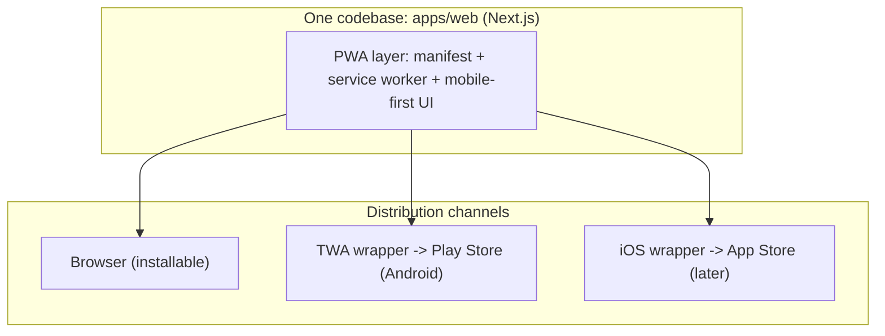

# Mobile App Strategy — PWA + Store Wrappers, Zero Native Code

> Decision: EduBridge ships as a **PWA (Progressive Web App)**; the Play Store listing is a **TWA (Trusted Web Activity)** wrapper around it. No React Native, no native codebase, no second UI to maintain — the web app IS the app. This doc answers "can I publish to Play Store / iOS without changing code?" honestly, including the iOS caveats.

## The short answer

| Platform | Store listing without native code? | How |
|----------|-----------------------------------|-----|
| **Android (Play Store)** | **Yes, fully** | TWA wrapper via Bubblewrap or PWABuilder — wraps the PWA, renders full-screen from our domain, no Java/Kotlin/React Native written |
| **iOS (home screen)** | **Yes** | PWA "Add to Home Screen" — works today, zero store involvement |
| **iOS (App Store)** | **Yes, with a cloud build** — no local Xcode/Mac needed | PWABuilder's iOS package or a cloud build service (Codemagic/Ionic Appflow) builds and submits the wrapper in CI. Apple review is stricter for wrapper apps, and an Apple Developer account ($99/yr) is required. Recommended only after the Android listing proves demand |

## Architecture

The parent app is **not a separate app** — it's the same `apps/edubridge` with a family-focused, mobile-first route surface (`/[workspace]/family/...`). School staff on desktop and parents/students on phones share one codebase; responsive design and the PWA layer serve both.

**Family login:** admission number + student DOB for **parents and students** (option B). Session is a **first-party HttpOnly cookie** (`edubridge.family`), not `localStorage` and not a Capacitor Preferences JWT. Multi-child parents use one session + child switcher (Phase 1 UI). Canonical architecture: [auth/family-access.md](./auth/family-access.md). Staff keep `/sign-in` (password / office create / domain join).

## Family cookie and PWA / TWA / iOS

Production school identity is the **host** (`{slug}.edubridge.app`). The family cookie stays **first-party** on that origin.

| Constraint | Rule |
|------------|------|
| Cookie | HttpOnly + Secure-in-prod + SameSite=lax. HMAC-SHA256. Name `edubridge.family`. |
| Production path | `Path=/family` on `{slug}.edubridge.app`. **Never** `Domain=.edubridge.app` (would share family cookies across schools). |
| Local path | `Path=/{slug}/family` on localhost so Pilot and Oakwood do not share a cookie. |
| Manifest (when the family surface ships) | On the **school origin**: `start_url: "/family"`, `scope: "/family"` so the installed app cannot navigate into Team/Fees as “the app.” |
| Staff | Desktop/browser; not the Play Store parent app. |
| TWA | `assetlinks.json` per school host (or `*.edubridge.app` + package) — still first-party cookies. |
| Storage | **Do not** store the family session in `localStorage` or Capacitor Preferences. That is the wrapper-pain / ITP path. |
| TTL | Sliding ~30 days on the family door (phones expect “stay in the app”). Re-proof on a new device. |
| iOS App Store wrapper (later) | Smoke-test WKWebView cookie persistence before submit; default remains TWA + iOS home screen. |

Two siblings at two schools = two PWA installs (two hosts), which is the correct isolation.

## What makes the app "PWA-ready" (start in Phase 0–1, cheap habits)

1. **Web app manifest** — `app/manifest.ts` in Next.js: name, short_name, icons (192/512, maskable), theme_color, background_color, `display: "standalone"`, family `start_url` `/family` and `scope` `/family` on the school host.
2. **Service worker** — app-shell caching + offline fallback page. Options: Serwist (`@serwist/next`, actively maintained successor to next-pwa) or a small hand-rolled SW. MVP scope: cache static shell + show an offline notice; **do not** cache tenant API data (privacy + staleness risk with school data).
3. **Mobile-first CSS** — Tailwind is mobile-first by default; enforce in review: every screen usable at 360px width before desktop polish.
4. **Install prompts** — custom "Install app" affordance on the family surface (`beforeinstallprompt`), plus instructions for iOS (Share → Add to Home Screen).
5. **Push notifications — not in MVP.** WhatsApp is our parent channel (Phase 2); web push is a later option.

## Android: Play Store via TWA (the decided path)

A TWA is Play's official way to list a PWA: the store app is a thin shell that opens our PWA full-screen, verified as ours. Steps when we're ready (post-MVP task):

1. Generate the wrapper with **Bubblewrap** (CLI) or **PWABuilder** (web UI) — both produce the Android package from the manifest URL; no native code written.
2. Host `assetlinks.json` at `/.well-known/assetlinks.json` on our domain — this digitally proves the website and app are the same owner (otherwise the app shows a URL bar).
3. Enroll in **Play App Signing**, upload the signed AAB, fill the store listing.
4. Updates: web deploys update the app instantly — **no store resubmission for content changes**. Only manifest-level changes (name, icons) need a new wrapper build.

Cost: one-time $25 Play Developer account.

## iOS: the honest trade-offs

- **Today:** iOS users install via Safari "Add to Home Screen" — full-screen, icon, offline shell. Zero store, zero cost. For Indian school parents, Android dominates anyway; iOS PWA covers the rest initially.
- **App Store later:** PWABuilder generates an iOS package; a **cloud build service** (Codemagic, Ionic Appflow) compiles and submits it — **no Mac or local Xcode required** (Xcode runs in their CI). Caveats: $99/yr Apple Developer account, Apple's guideline 4.2 ("minimum functionality") scrutiny of wrapper apps — mitigate with native-feel details (splash, offline page, install-free login) before submitting.
- **Decision checkpoint:** revisit after the Android listing + parent adoption data (Phase 5–6). Recorded as an open question in [product-vision.md](../roadmap/product-vision.md).

## The parent / student family experience (requirements shaping the PWA work)

- **Login:** `/{slug}/family` — admission number + student date of birth for parents **and** students — see [auth/family-access.md](./auth/family-access.md). First-party cookie session (not `localStorage`). No OTP, no password for mass family users. Rate-limited (IP + admission + slug), generic errors, read-only scope.
- **Parent wrapper:** after verifying one child, **Add child** with another admission+DOB; child switcher — one session for siblings.
- **Read-only:** dashboard, attendance, marks, report cards, fee status (later). No data entry.
- **Share/receive:** WhatsApp reports land as messages (Phase 2); the app is for pull-based checking.
- **AI Q&A (later):** ask questions about the child ("How is Riya doing in maths?") — routed through the agent ecosystem with parent-scoped tools ([agent-ecosystem.md](./agent-ecosystem.md)).

## Non-goals

- No React Native / Flutter / native modules — rejected: doubles the codebase for zero user benefit at our stage.
- No Capacitor in the default path (TWA is lighter on Android; Capacitor becomes relevant only if we need deep device APIs like background push at scale). Do not move family session into JS storage to “fix” a wrapper.
- No offline editing of school data (read-only offline fallback only).

## Pre-store checklist (run when listing Android)

- [ ] Manifest valid (maskable icons, theme colors, `display: standalone`, `start_url`/`scope` `/family` on the school host)
- [ ] Service worker caches shell only; no tenant data cached
- [ ] Lighthouse PWA audit green on the family surface
- [ ] `assetlinks.json` hosted and verified
- [ ] Play App Signing enrolled; AAB from Bubblewrap/PWABuilder uploaded
- [ ] Store listing: screenshots from real school workflows (premium UI is the sales asset)

## References

- [web.dev: TWA](https://developer.chrome.com/docs/android/trusted-web-activity) · [Bubblewrap](https://github.com/GoogleChromeLabs/bubblewrap) · [PWABuilder](https://www.pwabuilder.com/)
- [Next.js manifest](https://nextjs.org/docs/app/api-reference/file-conventions/metadata/manifest) · [Serwist](https://serwist.pages.dev/)
- [agent-ecosystem.md](./agent-ecosystem.md) — parent Q&A design
- [product-vision.md](../roadmap/product-vision.md) — parent app in the module map
