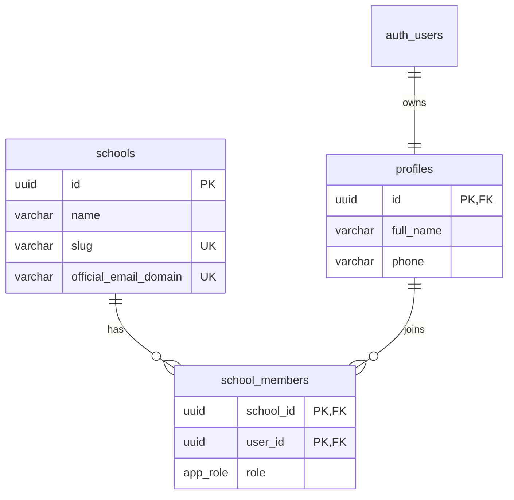

# Multi-tenancy baseline

Phase 0 reference for school isolation, core relationships, and platform-owner
separation. Read this before adding a tenant table or authorization policy.

Durable SaaS boundaries (three authz contexts, folders, URLs):
[platform-boundaries.md](./platform-boundaries.md). Temporary support entry:
[support-access.md](./support-access.md). Hostname strategy:
[ADR-006](../decisions/ADR-006-workspace-subdomains.md).

## Model

All schools share one Supabase Postgres project. Tenant rows carry a
`school_id`; RLS enforces isolation. Physical databases per school are not part
of Phase 0.

- Composite `school_members(school_id, user_id)` prevents duplicate membership.
- Every FK lookup is covered by the composite PK or an explicit index.
- Official email domains and workspace slugs are normalized and unique.
- Future tenant tables reference `schools.id` and index `school_id`.

## RLS boundary

- `anon` has no table privileges.
- Authenticated users can only read schools and memberships they belong to.
- Only `school_admin` can update its school or manage memberships.
- Profiles are self-managed and readable by users who share a school.
- Private `SECURITY DEFINER` helpers prevent recursive membership-policy checks.
- Tenant Drizzle transactions set JWT claims, then `SET LOCAL ROLE
authenticated`; this is required because the pool connects as privileged
  `postgres`, which otherwise bypasses RLS.

The first migration and a rollback-only isolation test live under
`packages/db/migrations/` and `packages/db/tests/`.

## Platform owner

`platform_owner` is reserved in the enum but **forbidden** in `school_members`.

- Auditable source of truth: a `platform_admins` table (Phase 6 console; reserve
  the pattern from Phase 0). Optional `app_metadata` cache later — never
  user-editable `user_metadata`.
- Console access is **billing and aggregate views only** — not a general tenant
  data browser. See [platform-boundaries.md](./platform-boundaries.md).
- Workspace content requires a school-approved support grant
  ([support-access.md](./support-access.md)), never silent membership.

## Workspace URLs

- **Phase 0 / local:** path-based `/{slug}` (slug ends `-bridge`).
- **Production (Phase 6):** `<slug>.edubridge.app` via host rewrite in `proxy.ts`
  ([ADR-006](../decisions/ADR-006-workspace-subdomains.md)).
- Hostname selects the school candidate; membership or grant authorizes access.

## Development probe

`/db-check` is a server-rendered connectivity probe that lists pilot schools.
It returns 404 in production and is not an authorization pattern. Product
queries must use `withTenant()`.
