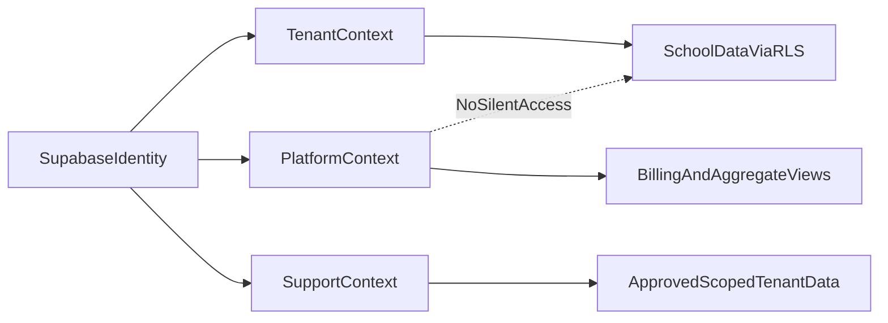

# Platform Boundaries — Identity, Tenancy, and Consoles

> Durable SaaS boundaries for EduBridge. One identity system; three authorization
> contexts; one product app with isolated feature folders. Read this before
> adding platform, billing, registration, or support surfaces.

Related: [multi-tenancy.md](./multi-tenancy.md), [auth/rbac-model.md](./auth/rbac-model.md),
[support-access.md](./support-access.md), [ADR-006](../decisions/ADR-006-workspace-subdomains.md),
[workspace-urls.md](./workspace-urls.md),
[feature-folder-structure.md](../guides/feature-folder-structure.md).

## Industry model (locked)

Do **not** build multiple authentication systems. Use **one** Supabase Auth
project (one `auth.users` row per person), then apply three independent
authorization contexts:

| Context | Source of truth | May access |
|---------|-----------------|------------|
| **Tenant** | `school_members` for the hostname-resolved school | That school's tenant data via `withTenant()` + RLS |
| **Platform** | `platform_admins` table (auditable); optional claim cache later | Billing, subscriptions, provisioning metadata, aggregate views only |
| **Support** | School-admin-approved, expiring `support_access_grants` | Scoped workspace data for the grant window — never via silent membership |



### Hard rules

1. `platform_owner` / platform admins **never** receive a `school_members` row for
   ordinary console work.
2. Hostname or slug selects the school candidate; **membership or grant** decides
   access. Hostname alone is never authorization.
3. Cross-tenant reads exist only through dedicated security-definer views used by
   `features/platform-console/`. Reusing those views as a general data API is forbidden.
4. Modules never import other modules; shared code goes up to `lib/`, `packages/ui`,
   or `packages/db` only after two real consumers.

## URL surface (summary)

Full decision: [ADR-006](../decisions/ADR-006-workspace-subdomains.md).
How to get there without breaking path URLs: [workspace-urls.md](./workspace-urls.md),
open checkboxes: [platform-launch.md](../wayfinder/platform-launch.md).

| Audience | Production (after slice C) | Local development (keep forever) |
|----------|----------------------------|----------------------------------|
| Public / marketing | `edubridge.app` | `localhost:3000` |
| Platform console | `platform.edubridge.app` | `localhost:3000/platform` |
| School workspace | `<slug>.edubridge.app` (slug ends `-bridge`) | `localhost:3000/<slug>` |

Today `proxy.ts` **rewrites** school and platform Hosts. `{slug}.edubridge.app` still needs Coolify DNS + TLS before it is reachable on the public internet. Feature code always sees the same `[workspace]` parameter. Admin home shows the shareable School URL.

## Folder architecture (product app)

Keep **`apps/edubridge`** as the only product app ([ADR-005](../decisions/ADR-005-primary-app-edubridge.md)).
Do not fork a second frontend for platform vs tenant.

```text
apps/edubridge/
├── proxy.ts                         # session refresh + host → route rewrite
├── app/
│   ├── (marketing)/                 # public pages; registration routes (Phase 6)
│   ├── (auth)/                      # shared sign-in, recovery, domain join
│   ├── auth/callback/               # magic-link / OAuth code exchange
│   ├── platform/                    # platform.edubridge.app thin routes
│   └── [workspace]/                 # school subdomain/path thin routes
├── features/
│   ├── auth/                        # identity UI/actions only
│   ├── registration/                # school creation + provisioning (Phase 6)
│   ├── memberships/                 # school member + role management
│   ├── billing/                     # school-facing plan, invoices, state (Phase 6)
│   ├── platform-console/            # owner billing/funnel/tenant metadata (Phase 6)
│   ├── support-access/              # request/approve/enter/revoke/audit (Phase 6)
│   ├── shell/                       # workspace chrome + module registry
│   └── <product-module>/            # student-dashboard, report-cards, …
└── lib/
    ├── auth/                        # verified identity + Supabase server clients
    ├── tenancy/                     # hostname/slug resolution + getSessionContext
    └── access/                      # platform/support contexts + shared guards
```

### Feature isolation contract

Each feature follows [feature-folder-structure.md](../guides/feature-folder-structure.md):

- Own `components/`, `actions/`, `queries/`, `lib/`, `types.ts`, `index.ts`, `README.md`
- Routes in `app/` stay thin — compose feature exports only
- Other code imports **only** from `features/<module>/index.ts`
- Features never import features
- `packages/db` stays schema + Drizzle client; do not mirror empty feature trees there
- Promote helpers to `apps/edubridge/lib/` only at **2+** consumers

### Which surface owns which concern

| Concern | Feature folder | Phase |
|---------|----------------|-------|
| Sign-in / sign-out / password / magic link | `features/auth/` | 0 |
| Member create inside a school | `features/auth/` (directory Add member) | 0 |
| Workspace chrome + nav registry | `features/shell/` | 0 |
| Public school registration | `features/registration/` | 6 |
| School subscription / invoices | `features/billing/` | 6 |
| Cross-tenant owner console | `features/platform-console/` | 6 |
| Temporary support grants | `features/support-access/` | 6 |
| Product modules (dashboard, etc.) | `features/<name>/` | 1+ |

## Access contracts

### School workspace (tenant)

- Verified identity + live `school_members` row for the resolved school → tenant context.
- Every tenant query runs through `withTenant()`; RLS is the backstop.
- School registration is one atomic provisioning op: school + first
  `school_admin`. Trial subscription and entitlements remain Phase 6.2.

### Platform console

- `platform_admins` is the auditable source of truth (set via service-role only).
- Console reads **only** dedicated aggregate views (school metadata, plan state,
  invoices, revenue, funnel). No general tenant-table browser.
- No automatic workspace access; support entry requires [support-access.md](./support-access.md).

### Temporary support mode

See [support-access.md](./support-access.md). Summary: school-admin grant,
time-boxed, read-only by default, explicit write scopes, banner + audit,
RLS helpers — never insert the owner into `school_members`.

## Phase split (do not collapse)

| Now | Later (open on [platform-launch](../wayfinder/platform-launch.md)) |
|-----|---------------------------------------------------------------------|
| Identity + SSR clients + `getSessionContext` | Host rewrite + wildcard DNS (6.6) |
| Office-created membership + domain join | Plans, trials, payments, entitlements (6.2–6.4) |
| Public `/register` thin slice (6.1 shipped) | Trial row + entitlements on provision |
| Path/workspace shell | `{slug}.edubridge.app` (path fallback stays) |
| Platform enum / admin table reserved | Full platform console UI (6.5) |
| Architecture docs for support | `support_access_grants` + RLS + UI (6.7) |

Do not implement billing, wildcard DNS, or support grants in a Control Hub or
Fees PR. Registration already exists — do not rebuild it. Leave path routes so
6.6 is a rewrite, not a folder move.

## Acceptance checks (specification)

- Platform admin cannot read school content without an active school-approved grant.
- Support grant cannot outlive expiry, expand its own scopes, or survive revocation.
- Tenant modules cannot import one another or bypass `withTenant()`.
- School subdomain/path resolves to one server-verified school; hostname ≠ authz.
- Billing/aggregate owner queries are not reusable as general cross-tenant access.
- Adding a product module requires only: feature folder, thin routes, registry
  entry, schema/RLS, and feature documentation.
