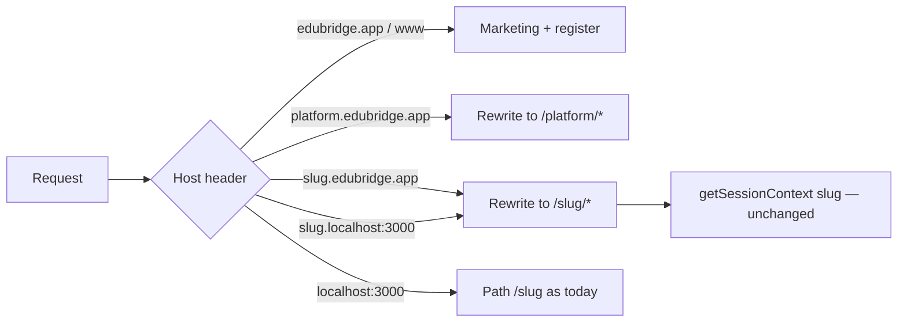

# Workspace URLs — path locally, subdomain in production

> How every school gets an isolated URL without a second app or a second database.
> **Target** (Phase 6) is not live on `edubridge.app` until Coolify DNS + TLS exist.
> The **app rewrite** (slice C) is in code: local `/{slug}` still works; `{slug}.localhost`
> and `{slug}.edubridge.app` rewrite onto the same `[workspace]` tree.

Related: [ADR-006](../decisions/ADR-006-workspace-subdomains.md),
[platform-boundaries.md](./platform-boundaries.md),
[multi-tenancy.md](./multi-tenancy.md),
[auth README — two doors](./auth/README.md#two-doors-school-is-the-url),
Phase 6 [§6.6](../roadmap/phase-6-platform-growth.md).
HITL: [Coolify + Hetzner](../wayfinder/tickets/task-coolify-hetzner.md).

## What this is called

**Subdomain-based multi-tenancy** (wildcard-subdomain SaaS).
One Next.js app. `proxy.ts` reads `Host` / `X-Forwarded-Host` and rewrites
`{slug}.edubridge.app/...` onto the existing `/[workspace]/...` tree. Wildcard
DNS + one wildcard TLS cert (`*.edubridge.app`) cover every school without
per-school setup. Coolify Traefik does the cert; the app does the rewrite.

References (external):

- [Coolify wildcard certs — SaaS (one app, every subdomain)](https://coolify.io/docs/knowledge-base/proxy/traefik/wildcard-certs#saas--route-every-subdomain-to-one-application)
- [Coolify Traefik DNS-01 (Hetzner tab)](https://coolify.io/docs/knowledge-base/proxy/traefik/dns-challenge)
- [vercel/platforms](https://github.com/vercel/platforms) — same Next.js 16 `proxy.ts` pattern (hosting-agnostic)
- [Next.js 16 proxy](https://nextjs.org/docs/app/api-reference/file-conventions/proxy)

## Locked facts

| Fact | Value |
|------|--------|
| Public domain | `edubridge.app` (`PLATFORM_DOMAIN` in `apps/edubridge/lib/brand.ts`) — not `.com` |
| School host | **slug**, not display name: `dps-jaipur-bridge.edubridge.app`, never `DPS Jaipur.edubridge.app` |
| Slug shape | kebab + `-bridge` suffix; reserved names in `RESERVED_WORKSPACE_SLUGS` |
| Local (keep forever) | `localhost:3000/{slug}/…` |
| Local optional | `{slug}.localhost:3000` (browsers map `*.localhost` to loopback) |
| Production | `{slug}.edubridge.app/…` once DNS + TLS exist |
| Hosting (this effort) | **Coolify on a Hetzner VPS.** Same `proxy.ts`. Vercel remains a compatible alternative (same rewrite). |
| Plans | Paid `normal` / `pro` / `max`; 15-day **Max** trial; expiry → read-only. No free tier |
| Admin login | There is no separate admin door. School admin is **staff**. Chooser → School |

## Target (after DNS + TLS)

| Moment | URL |
|--------|-----|
| First-time school register | `edubridge.app` (marketing + `/register`) |
| After register | `{slug}.edubridge.app` (slice D still redirects to `/{slug}` locally and until post-register host lands) |
| Admin / staff / family | Same host; paths `/sign-in`, `/family/home`, `/students` |
| Staff bookmark | Apex `/sign-in` (email + optional slug) — family never uses this page |
| Platform console | `platform.edubridge.app` |

Chooser is `{slug}.edubridge.app/sign-in`. Family cookie Path `/family` matches because family pages are `/family/*` on that host.

Admin **home** always shows the shareable host `{slug}.edubridge.app` (copy button), including on localhost, so the live URL is visible before DNS is on.

## Today vs that target

| | Local now | Coolify **without** wildcard DNS | After DNS + TLS |
|--|-----------|----------------------------------|-----------------|
| Register a school | `/register` on `:3000` | Same path on the apex you pointed | Yes, on `edubridge.app` |
| School URL | `localhost:3000/{slug}/…` or `{slug}.localhost:3000` | Path on apex **or** subdomain if Traefik already routes Host | `{slug}.edubridge.app/…` |
| Admin / staff sign-in | `/{slug}/sign-in` → How are you? → School | Same chooser; on a school Host the browser path is `/sign-in` | `{slug}.edubridge.app/sign-in` |
| Family cookie | Host-aware: path host → `Path=/{slug}/family`; school host → `Path=/family` | Same | `/family` on the school host |
| Homepage Sign in | `/sign-in` staff bookmark | Same | Apex staff bookmark; school people use their subdomain |

**Will it look like the target table if you only ship the app?** The rewrite is in `proxy.ts`. Without `*.edubridge.app` → VPS and a wildcard cert, browsers never hit a school Host. Admin home still shows the URL they will use.

## Dual-mode invariant (do not break)

Path-based workspaces are not a prototype to delete. They are the **local and fallback** contract.

1. **Never remove** `app/[workspace]/` routes. Feature code always receives the slug param.
2. **Host rewrite is additive.** Production host `{slug}.edubridge.app/fees` rewrites internally to `/{slug}/fees`. The browser URL stays the subdomain.
3. **Local path URLs stay valid:** `localhost:3000/{slug}/sign-in` still opens the chooser.
4. **Optional local subdomain:** `{slug}.localhost:3000` — no `/etc/hosts` required.
5. Hostname/slug only **selects** the school candidate. Access still needs `school_members`, platform admin, or a support grant.
6. **Do not rewrite every `Link`.** Existing `href={`/${workspace}/fees`}` on a school host **308**s to `/fees`. Canonical browser path has no slug prefix.

## Cookies

| Cookie | Isolation | Never |
|--------|-----------|-------|
| Supabase staff session | **Host-only** (no `Domain` attribute). Each school host is its own session | `Domain=.edubridge.app` (would leak staff across schools) |
| Family HMAC (`edubridge.family`) | School host → `Path=/family`. Path-mode (localhost, apex, Coolify preview) → `Path=/{slug}/family` | Same `Domain=.edubridge.app` |

`familyCookiePath` keys off **Host**, not `NODE_ENV`. A path-only production URL is safe for family.

## What already exists (do not redo)

- Public `/register` wizard, OTP/magic-link, atomic `schools` + first `school_admin` ([registration](../../apps/edubridge/features/registration/))
- Slug `-bridge` + reserved blocklist (`lib/tenancy/school-slug.ts`)
- Host parser (`lib/tenancy/workspace-host.ts`)
- `proxy.ts` Host rewrite + slug-prefix 308 + host-aware staff `/sign-in` redirect
- Host-aware family cookie Path
- Admin home **School URL** card (`{slug}.edubridge.app` + copy)
- `getSessionContext(schoolSlug)` — path slug only; keep it that way (rewrite supplies the param)

## What does not exist yet (HITL / later slices)

- Domain owned + `A` / `*.` → Hetzner VPS + Traefik DNS-01 wildcard cert
- Coolify Dockerfile / `output: "standalone"` (needed to **run** on Coolify, not for the rewrite itself)
- CI workflows
- `plans` / `subscriptions` / `module_entitlements` (Control Hub `capability_overrides` is **permissions**, not SaaS module flags)
- Host-aware post-register redirect to `https://{slug}.edubridge.app` (slice D)

## Selective file changes (slice C — already in the app)

Only these files make the subdomain **work in Next** and **show on admin home**. Do not mass-edit `href={`/${workspace}`}` or delete `[workspace]` routes.

| File | Why |
|------|-----|
| `apps/edubridge/lib/tenancy/workspace-host.ts` | Parse Host / `X-Forwarded-Host` (Coolify Traefik sets the latter) |
| `apps/edubridge/proxy.ts` | Rewrite school/platform hosts; 308 strip `/{slug}` prefix; auth redirect to `/sign-in` on school host |
| `apps/edubridge/lib/tenancy/family-session-token.ts` | Cookie Path from host mode, not `NODE_ENV` |
| `apps/edubridge/lib/tenancy/family-session.ts` | Pass current Host into cookie options |
| `apps/edubridge/app/[workspace]/(staff)/page.tsx` | School URL on **admin home** |
| `apps/edubridge/features/shell/components/workspace-public-url.tsx` | Copyable `{slug}.edubridge.app` |
| `apps/edubridge/features/registration/components/welcome-setup-card.tsx` | Same host on the welcome card |
| `apps/edubridge/.env.example` | `NEXT_PUBLIC_SITE_URL` = apex |

**Not in this slice:** Dockerfile, `output: "standalone"`, billing schema, Control Hub, rewriting hundreds of links, cookie `Domain=`.

## Hosting — Coolify on Hetzner (production path)

The **app** (`proxy.ts` Host rewrite, cookies, slugs) does not care whether traffic arrives from Traefik or Vercel. DNS + TLS + the process that runs `next start` change.

**Production we are aiming at:** Coolify on a Hetzner VPS. Official Coolify docs match this SaaS shape — one application, every `{tenant}.domain` ([wildcard certs — SaaS](https://coolify.io/docs/knowledge-base/proxy/traefik/wildcard-certs#saas--route-every-subdomain-to-one-application)).

### Human steps (not app code)

Checklist lives on [task-coolify-hetzner.md](../wayfinder/tickets/task-coolify-hetzner.md). Summary:

1. **Hetzner VPS** (Ubuntu) + install Coolify. Open 80/443 (and SSH). Postgres stays **Supabase** — do not run tenant data on the VPS.
2. **DNS** at the registrar (or Hetzner DNS): apex `A` → VPS IPv4; wildcard `A` `*.edubridge.app` → same IP. Optional `AAAA` if you use IPv6. Do **not** put Cloudflare orange-cloud / Tunnel in front of arbitrary tenant hosts — tunnels do not cover `{every-slug}.edubridge.app`. Grey-cloud (DNS only) is fine.
3. **Traefik DNS-01** in Coolify — wildcard certs cannot use HTTP-01. Coolify’s documented provider tab includes **Hetzner** ([DNS challenge](https://coolify.io/docs/knowledge-base/proxy/traefik/dns-challenge)). Create a Hetzner DNS API token; paste it in Coolify. Cloudflare / Route 53 also work if DNS lives there instead.
4. **Coolify application** (when you deploy): Domain field **empty**; custom Traefik labels `HostRegexp` so **every** subdomain hits this one container; listen port **3000** (not the docs’ example `80`). `HOSTNAME=0.0.0.0`. GitHub → Coolify auto-deploy on `main` still works.
5. **Next on Coolify** needs `output: "standalone"` + a Dockerfile (or Nixpacks equivalent). That is a **later deploy file**, not required for the rewrite to work on localhost / `{slug}.localhost`.
6. Env on the Coolify app: same secrets as local (Supabase, `DATABASE_URL` pooler, `FAMILY_SESSION_SECRET`, `IMPERSONATION_SECRET`). `NEXT_PUBLIC_SITE_URL=https://edubridge.app`.
7. **Supabase Auth** redirect URLs: apex + wildcard school hosts + `/auth/callback` ([task-supabase-auth-urls.md](../wayfinder/tickets/task-supabase-auth-urls.md)).
8. `apps/agent` is a **second** Coolify service (or Generative AI stays off). See [grill-agent-hosting.md](../wayfinder/tickets/grill-agent-hosting.md).

### What Traefik vs Next each own

| Layer | Job |
|-------|-----|
| DNS `*.edubridge.app` | Every school Host arrives at the VPS |
| Traefik + DNS-01 | TLS for `edubridge.app` and `*.edubridge.app`; route **all** those Hosts to the **same** container |
| `proxy.ts` | Read Host; rewrite to `/[workspace]/…`; 308 canonical paths |

If Traefik only has `edubridge.app` (no wildcard / no `HostRegexp`), Next never sees `dps-jaipur-bridge.edubridge.app` and the admin URL will not open, even though the rewrite code is correct.

### Vercel (compatible, not the plan)

Same `proxy.ts`. Wildcard cert on Vercel requires **Vercel nameservers**. Tickets: [research-vercel-turborepo.md](../wayfinder/tickets/research-vercel-turborepo.md), [task-vercel-project-and-env.md](../wayfinder/tickets/task-vercel-project-and-env.md). Do not mix “nameservers at Vercel” with “A records to Hetzner” for the same zone.

## Plans vs Control Hub

| Layer | What it answers | Code |
|-------|-----------------|------|
| **Entitlement** (later) | Does this **school** have Report Cards / Fees / AI at all? | `module_entitlements` + plan defaults |
| **Capability** (Control Hub) | May this **role/member** collect fees? | `can()` / `capability_overrides` |

A school on Normal with Fees entitled still uses Hub to decide who may `fees.collect`. Do not merge the two tables.

## Slice order (implementation)

Do not skip ahead. Checkboxes live on [platform-launch.md](../wayfinder/platform-launch.md).

| Slice | Goal | Do not touch |
|-------|------|----------------|
| **0 — docs** | Architecture + open map | — |
| **A — CI** | `lint` / `check-types` / `build` on PRs | Routing, cookies, schema |
| **B — DNS + Coolify + Auth URLs** | Apex + `*.edubridge.app` on Hetzner; Traefik DNS-01; Supabase redirects | Dockerfile until you actually deploy the container |
| **C — host rewrite** | `proxy.ts` + host-aware family Path + admin School URL | Billing tables; removing path routes |
| **D — post-register host** | Founder lands on `{slug}.edubridge.app` in prod | Local path redirect still `/{slug}` |
| **E — plans / trial / flags** | 15-day Max trial + entitlements + read-only | Payments provider until research ADR; Control Hub schema |
| **F — smoke** | Two-school RLS + family persist + path local still works | — |

Payments (6.4), owner console (6.5), support grants (6.7), customer custom domains: later tickets. Not in slices A–D.
