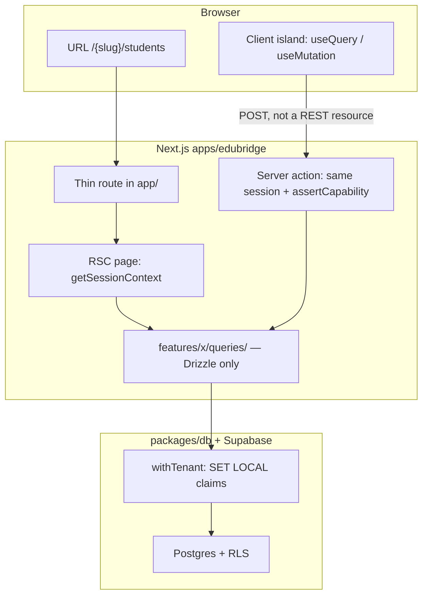

# TanStack Query in EduBridge

How the product app loads data, where TanStack Query sits, and which files own configuration and errors. Decision: [ADR-011](../decisions/ADR-011-tanstack-query-client-cache.md). Server/DB rules: [data-access.md](../architecture/data-access.md).

**Read this when** you add a client island, a mutation, or a live lookup (username-style). Do not start from a REST client or a new state library.

---

## Split (the rule)

Two paths. Neither replaces the other.

| Path | Runs | Job |
|------|------|-----|
| **RSC** | Server page → `getSessionContext` → `withTenant` → `queries/` | **First paint.** View Source already has names, amounts, roster. |
| **TQ** | Browser hook → `"use server"` action → same Drizzle path | **After paint.** Type, save, toggle without a full navigation. |
| **Cache clear** | `CacheClearForm` → native POST | **Identity change.** Wipe the browser cache, then sign-out / impersonate / switch child. |

`QueryProvider` wraps the whole app. That does **not** mean lists are TQ. Lists stay RSC on purpose. There is no `useActionState` in `apps/edubridge`. There is no `HydrationBoundary` — do not convert an RSC list to `useQuery` until that ships.

---

## What is TQ

Shared helper: `lib/query/use-action-mutation.ts` (`retry: 0`, tenant `invalidateQueries`, rethrow `NEXT_REDIRECT`, optional `clearCache`). Live lookups use `useQuery` + debounce in the hook.

### `useQuery` (debounced lookup)

| Feature | Hook | Action |
|---------|------|--------|
| Auth | `useUsernameCheck` | `checkUsernameAction` |
| Registration | `useSlugCheck` | `checkSlugAction` |

### `useMutation` (forms and switches)

| Feature | Hook | Action |
|---------|------|--------|
| Fees | `useRecordPayment` | `recordPaymentAction` |
| Fees | `useRegisterStudent` | `registerStudentAction` |
| Fees | `usePublishFeePlan` | `publishFeePlanAction` |
| Students | `useRecordAttendance` | `recordAttendanceAction` |
| Students | `useRecordClassActivity` | `recordClassActivityAction` |
| Auth | `useSetHubFlag` | `setHubFlagAction` |
| Auth | `useSignIn` | `signInAction` (`clearCache`) |
| Auth | `useFamilySignIn` | `familySignInAction` (`clearCache`) |
| Auth | `useFamilyAddChild` | `familyAddChildAction` (`clearCache`) |
| Auth | `useSchoolDomainSignUp` | `schoolDomainSignUpAction` |
| Auth | `useForgotPassword` / `useUpdatePassword` | `requestPasswordResetAction` / `updatePasswordAction` |
| Auth | `useActivateMember` / `useRejectMember` | activate / reject membership request |
| Auth | `useProvisionMember` | `provisionMemberAction` |
| Auth | `useResetMemberPassword` | `resetMemberPasswordAction` |
| Auth | `useStaffMemberActions` | role / active / archive |
| Registration | `useStartSchoolRegister` | `startSchoolRegisterAction` (`clearCache`) |
| Registration | `useVerifyRegisterOtp` / `useResendRegisterOtp` | verify / resend OTP |

Widgets that call these hooks sit in `QueryIsland`. Keys live in `lib/query/keys.ts` — do not invent strings in components.

---

## What is purposely RSC (or native)

Not a gap. Do not “finish” these with TQ.

| Surface | Why |
|---------|-----|
| Fees collections, structures, register pages (the **lists** and timelines) | First paint from `queries/fees` |
| Students roster, directory, student detail, family hub (home / fees / progress / exams / events) | First paint from student-dashboard `queries/` |
| Staff directory **table rows** | RSC `listSchoolMembers`. Switches/forms on the row are TQ (above) |
| Team pending-join **list** | RSC select. Activate/reject buttons are TQ |
| Control Hub **matrix HTML** | RSC. Switches are TQ |
| Class / date filter | GET navigation (`action="/{slug}/students"`). URL is the state |
| Sign-out, impersonation start/stop, family child switch | `CacheClearForm` then the action. Not `useMutation` |
| Marketing, legal, shell chrome (nav, search, module cards) | No tenant server-state to cache |
| `HydrationBoundary` / replacing RSC lists with `useQuery` | Not shipped. Ask before adding |

Out of scope unless asked: DevTools, Zustand/Redux, REST CRUD, Drizzle schema changes.

---

## Explain this to an engineer (5 minutes)

We are **not** using a REST API (`/api/fees`, `/api/students`) and we are **not** replacing Next.js. The backend RPC **is** Next.js `"use server"` actions. TanStack Query is a **client cache** around those actions.

### Folder roles (all three exist; none replaces the others)

| Name | Where | What it is |
|------|--------|------------|
| **Route** | `apps/edubridge/app/.../page.tsx` | URL only. Thin. No SQL. |
| **queries/** | `features/<module>/queries/*.ts` | **Server-only** Drizzle reads. Used by RSC pages. Never imported from the browser. The word “query” here means SQL, not TanStack Query. |
| **actions/** | `features/<module>/actions/*.ts` | `"use server"` functions. Session + `assertCapability` + `withTenant` + Drizzle write/read. This is the only way the browser talks to the DB. |
| **hooks/** | `features/<module>/hooks/use-*.ts` | Browser. `useQuery` / `useMutation` from TanStack Query. Each hook **calls an action**. It does not call `queries/` and does not open Postgres. |

Sign-in, publish, class events, staff toggles, and registration use the same TQ hooks as payment. The **page around them** is still RSC. React `useActionState` is not used in `apps/edubridge`.

### What the Next.js terminal is showing

Next logs **the server**. TanStack Query **does not run there**.

| You see | What it actually is | TanStack Query? |
|---------|---------------------|-----------------|
| `GET /edubridge-pilot-bridge/fees 200` | RSC **page load**. Route rendered HTML from `queries/` | No |
| `GET /.../students?class=...&date=...` | Same: server painted the roster | No |
| `POST /sign-in 200` + `└ f signInAction` | `"use server"` action from the sign-in form | **Yes** — TQ `useMutation` (`clearQueryCache` first) |
| `POST /.../fees/collections` + `└ f recordPaymentAction` | Server action invoked from the payment form | **Yes** — TQ `useMutation` called that action |

There is no `/api/record-payment` route to log. The POST URL is the **current page**. The function name under `└ f` is the real “endpoint”.

### Where the `[tq]` line appears

Dev-only, **one logger** in `lib/query/debug.ts` (attached from `client.ts`). It prints in the **browser DevTools console**, not in the turbo terminal:

```
[tq] query ["edubridge","auth","username-check","pilot","jane"] @ /edubridge-pilot-bridge/join
[tq] mutate ["edubridge","fees","record-payment"] @ /edubridge-pilot-bridge/fees/collections
```

To see it: open the app → DevTools → Console → filter `tq`. Then type a username, or save attendance, or record a payment. Correlate with the terminal’s `└ f checkUsernameAction` / `recordAttendanceAction` / `recordPaymentAction`.

---

## Two paths to the database

There is **no** browser → Postgres hop. The browser never imports `@repo/db`. Both paths end in the same place: session → capability → `withTenant` → Drizzle → Supabase Postgres + RLS.



### Path A — first paint (routing)

This is what View Source shows. No TanStack Query.

1. User opens `/{workspace}/fees/collections` (or `{slug}.edubridge.app/...`).
2. Next.js matches a **thin route** in `apps/edubridge/app/`. The route does not contain SQL.
3. The route renders a **Server Component** (page or feature page such as `SchoolStudentsPage`).
4. That component calls `getSessionContext(workspace)` (cookie → school + role; impersonation swaps the effective user).
5. `can()` / `assertCapability` gates the page (`notFound()` if the role cannot see it).
6. `withTenant({ sub, school_id, role }, tx => …)` borrows a connection from the **existing** `getDb()` pool and sets RLS claims for that transaction.
7. Feature `queries/*.ts` run Drizzle on `tx`. HTML is streamed with names, amounts, roster already in it.

RSC is the source of truth for first paint. Do not replace an RSC list with `useQuery` unless you also add `HydrationBoundary` (we have not).

### Path B — after paint (TanStack Query)

This is typing, saving, toggling — without a full navigation.

1. A client component inside `QueryProvider` calls a feature hook (`useUsernameCheck`, `useRecordAttendance`, `useRecordPayment`, …).
2. The hook uses `useQuery` or `useMutation` with a key from `queryKeys` in `lib/query/keys.ts`.
3. `queryFn` / `mutationFn` calls a **server action** (`"use server"`). Next.js posts to that action. That is the only “backend hit” from the island.
4. The action repeats session → capability → `withTenant` → Drizzle (or `getDb()` for pre-auth username check).
5. On mutation success the action still `revalidatePath` (Next cache) **and** the hook `invalidateQueries` (client cache).

Hooks never import `queries/` or `@repo/db`. They only import actions.

| Layer | Folder | Runs on | Talks to DB? |
|-------|--------|---------|--------------|
| Route | `app/` | Server | No |
| RSC page | `features/*/components/` or `app/` | Server | Via `queries/` |
| Hook | `features/*/hooks/` | Browser | No — calls action |
| Action | `features/*/actions/` | Server | Yes |
| Query | `features/*/queries/` | Server only | Yes |
| Schema / pool | `packages/db` | Server | Yes |

---

## Single place for TanStack Query

All shared cache code lives in `apps/edubridge/lib/query/`. Feature hooks import from here. Do not add a `packages/query`.

```
apps/edubridge/lib/query/
  client.ts               # QueryClient defaults + browser singleton
  debug.ts                # `[tq]` traces (dev, browser console only)
  use-action-mutation.ts  # shared useMutation: invalidate, retry 0, NEXT_REDIRECT
  invalidate-tenant.ts    # school / user / root key prefix
  clear-form.tsx          # wipe cache then native POST (sign-out / impersonate / child)
  provider.tsx            # mounted in app/providers.tsx
  keys.ts                 # cache-key factory
  types.ts                # ActionResult / ActionError
  errors.ts               # ActionClientError, unwrapAction, isNextNavigationError
  island.tsx              # isolated crash UI for one widget
```

Mounted once:

```tsx
// apps/edubridge/app/providers.tsx
<QueryProvider>{children}</QueryProvider>
```

### Configuration (`client.ts`)

| Option | Value | Why |
|--------|-------|-----|
| `staleTime` | 30s | Same lookup (e.g. username) is not refetched on every keystroke/remount |
| `gcTime` | 5 min | Unused cache entries drop; memory stays bounded |
| Query `retry` | 1 | One retry on network blip; username overrides to `0` |
| Mutation `retry` | **0** | Never double-submit money, attendance, or hub flags |
| `refetchOnWindowFocus` / `Reconnect` | true | Default; username turns focus refetch off |
| Server vs browser | New client per SSR request; **one singleton** in the browser | Avoids leaking cache across users on the server |

Change defaults only in `client.ts`. Per-hook overrides are for exceptions (username).

### Keys (`keys.ts`)

Every key starts with `edubridge` then **school** then (usually) **user**. That stops school A from reading school B’s cache. Identity changes (`CacheClearForm` / `clearCache: true`) wipe the browser singleton so impersonation leftovers cannot look like the admin’s data.

```ts
queryKeys.user(schoolId, userId)
queryKeys.students.roster(schoolId, userId, classId, date)
queryKeys.fees.all(schoolId, userId)
queryKeys.auth.usernameCheck(schoolSlug, username) // pre-auth: slug, not id
queryKeys.fees.recordPayment()                     // mutationKey for `[tq] mutate`
queryKeys.students.recordAttendance()
```

Add a key when a feature needs one. Do not invent parallel key strings in components.

---

## Errors: three files, three jobs

Do not invent a second error enum. HTTP/route errors and TQ action errors share `HttpErrorCode` from [`lib/http.ts`](../../apps/edubridge/lib/http.ts).

| File | Job |
|------|-----|
| `lib/http.ts` | Canonical codes (`FORBIDDEN`, `UNPROCESSABLE`, …) and route JSON envelope |
| `lib/query/types.ts` | `ActionResult<T>` = `{ ok: true, data }` or `{ ok: false, error }` |
| `lib/query/errors.ts` | `unwrapAction` throws `ActionClientError` so `useQuery` can use `isError` |
| `lib/query/island.tsx` | One widget crash does not blank the page |
| `app/error.tsx` | Real render crash of a route — not for expected validation |

**Expected failures** (taken username, bad amount, no capability): return `{ error: "…" }` from the action (today) or `ActionResult` (when we rewrite that action). Show them with toast / `isError`. Do **not** set `throwOnError`.

**Unexpected failures** (render throw inside an island): `QueryIsland` shows “Try again” for that widget only.

Migrated fees/attendance still use `{ ok?, error? }` + `useActionToast`. `ActionResult` + `unwrapAction` are ready for the next action we rewrite; username stays `{ available, reason }` because it is pre-auth and does not use `withTenant`.

---

## How to add the next mutation (recipe)

Copy attendance/fees. Do not add Zustand.

1. Keep the existing `"use server"` action. Do not change Drizzle or RLS.
2. Add keys in `lib/query/keys.ts` if the surface is new.
3. Add `features/<module>/hooks/use-<verb>.ts`: wrap `useActionMutation` from `lib/query/use-action-mutation.ts` (`retry: 0`, `mutationFn` calls the action, tenant `invalidateQueries` on success). Redirecting actions must rethrow `NEXT_REDIRECT` (handled in the helper). Sign-in-style identity changes pass `clearCache: true`.
4. In the client form: `form action={(fd) => mutate(fd)}`, `isPending`, `useActionToast(mutationResult ?? initial)`. Keep local `useState` for fields.
5. Wrap the widget in `QueryIsland` (hooks must live **inside** the island).
6. Pass `schoolId` and `userId` from the RSC parent (already in session). Do not pass them from the URL as trust.
7. Leave the RSC list on the page so HTML still contains data with JS disabled.

---

## Best practices we follow

1. **RSC first, TQ second.** First paint is server HTML. TQ is the after-paint cache, not the ORM.
2. **One transport.** Server actions only. No `fetch('/api/students')`, no Supabase `.from()` in the browser.
3. **One pool.** `getDb()` is a process singleton. Each request borrows a connection; it does not open a new Postgres client per click. Supabase pooler (6543) multiplexes further. TQ does not change that.
4. **Tenant in the key.** School + effective user on every cache key.
5. **Mutations never retry.** Payments and registers must not fire twice.
6. **Invalidate, don’t optimistic-update** (until a surface needs it). Server remains source of truth.
7. **Deep modules.** Callers use `queryKeys`, `useActionMutation`, `unwrapAction`, `QueryProvider`, `QueryIsland`. Implementation stays in `lib/query/`.
8. **No client DB imports.** ESLint/types plus review: `hooks/` and `'use client'` files must not import `@repo/db` or `queries/`.
9. **No extra stores.** RSC lists = first paint. TQ = after-paint cache. Forms = local field state. Session = cookies. URL filters = search params.
10. **Debounce in the hook**, not by aborting Postgres. Server actions ignore `AbortSignal`; username uses 400ms + `enabled`.

---

## Verify (each surface)

- Two schools: no A rows in B’s cache.
- After impersonation start/stop, lists match the effective user.
- One island error: rest of the page still works.
- Typing / remount does not multiply identical POSTs.
- `/students` and fees lists still ship names in HTML (View Source).
- `pnpm --filter edubridge check-types` on the change.
