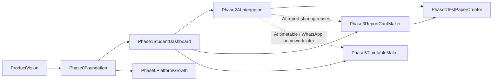

# EduBridge Roadmap

> **Start here.** This is the root index for all phase-wise planning documents. Humans and AI agents should read this file first, then open the file for the **active phase** before doing any work.

**EduBridge** is a multi-tenant school platform. Each school registers with its official email and gets an isolated workspace (its own URL and tenant-scoped data). Inside a workspace, a **unified application shell** (header with logo, module menu, active-module pill, search, profile) hosts independent modules that are added over time: Student Dashboard, Report Card Maker, Test Paper Creator, Timetable Maker, and more. AI (Mastra multi-step workflows) and a plan-based subscription engine (Normal/Pro/Max with per-school module toggles) are layered on once the foundation is solid.

## Phase philosophy

1. **Every phase ships something usable.** A phase is not done until its exit criteria pass.
2. **Later phases only build on earlier ones.** Never pull a future phase's scope into the current one.
3. **One phase active at a time.** The status column below is the single source of truth for what is being worked on.
4. **Modules are features, not apps.** Each module lives in `apps/edubridge/features/<module>/` behind the shared shell; it must never require a separate deployment.

## Phases

| #   | Phase                   | What it delivers                                                                                                                           | Status                                        | File                                                                   |
| --- | ----------------------- | ------------------------------------------------------------------------------------------------------------------------------------------ | --------------------------------------------- | ---------------------------------------------------------------------- |
| 0   | Foundation              | Supabase multi-tenant baseline, auth + RBAC, unified app shell, feature-folder structure                                                   | **Active** (0.1–0.2 done; **next: 0.3 auth**) | [phase-0-foundation.md](./phase-0-foundation.md)                       |
| 1   | Student Dashboard (MVP) | Role-based activity data entry, charts, parent/student read views                                                                          | Not started                                   | [phase-1-student-dashboard-mvp.md](./phase-1-student-dashboard-mvp.md) |
| 2   | AI Integration          | Mastra workflows, report summarization, WhatsApp report sharing                                                                            | Not started                                   | [phase-2-ai-integration.md](./phase-2-ai-integration.md)               |
| 3   | Report Card Maker       | Periodic/half-yearly/annual report cards, approval flow, PDF export                                                                        | Not started                                   | [phase-3-report-card-maker.md](./phase-3-report-card-maker.md)         |
| 4   | Test Paper Creator      | Question banks, test templates, AI-assisted generation, print/export                                                                       | Not started                                   | [phase-4-test-paper-creator.md](./phase-4-test-paper-creator.md)       |
| 5   | Timetable Maker         | Clash-free canvas (teacher double-book = red), Excel export, history, basic homework digest; AI assist later                               | Not started                                   | [phase-5-timetable-maker.md](./phase-5-timetable-maker.md)             |
| 6   | Platform Growth         | Public registration, provisioning, 15-day Max trial, plan subscriptions (3/6/12-month upfront), per-school module toggles, owner analytics | Not started                                   | [phase-6-platform-growth.md](./phase-6-platform-growth.md)             |

Supporting document: [product-vision.md](./product-vision.md) — the full brainstorming output (personas, module map, tenancy model, business model). Read it once for context; phase files are the actionable documents.

## Later modules (not yet phased)

Deliberately unscheduled — they enter the phase table only after the current phases ship. Their requirements are already captured so earlier phases don't paint us into a corner:

- **Parent App** — mobile-first PWA; parents **and** students enter with admission number + student DOB; multi-child parent wrapper ([family-access.md](../architecture/auth/family-access.md), [mobile-app.md](../architecture/mobile-app.md)). PWA-readiness is a Phase 0–1 habit (manifest, mobile-first CSS), not a big-bang project.
- **Admissions** — enquiry → application → admission records. Depends on Phase 1 student records.
- **Fees & Spending** — fee structure, collection, expense tracking. Max-plan module.
- **Activities** — events/achievements feed for dashboard + parent app.

## Phase dependencies

Notes:

- Phase 3 needs Phase 1 data (marks/attendance feed report cards) but does **not** need Phase 2; AI features inside report cards are optional enhancements.
- Phase 5 (Timetable Maker) needs Phase 1 academic structure; clash detection is deterministic and does **not** need Phase 2. AI reshape and WhatsApp homework are later upgrades on the same module.
- Phase 6 only needs Phase 0 technically (tenancy + auth), but should ship **last** commercially — sell the platform once modules exist.

## How to use these docs

**For humans:**

1. Read [product-vision.md](./product-vision.md) once.
2. Open the active phase file. Work top-to-bottom through its milestones.
3. When exit criteria pass, flip the status in the table above and open the next phase.

**For AI agents:**

1. Read this file first, then the active phase file — do not read all phase files by default.
2. Never implement scope from a "Not started" phase unless the user explicitly asks.
3. Follow the cross-phase standards below in every task, regardless of phase.
4. When a decision contradicts a phase file, update the phase file in the same change (docs and code move together).

## Cross-phase standards

These apply to **all** phases and are non-negotiable.

### Roles (RBAC)

Six platform roles, checked server-side on every read and write:

| Role             | Scope                 | Summary                                                                                                        |
| ---------------- | --------------------- | -------------------------------------------------------------------------------------------------------------- |
| `platform_owner` | Global (cross-tenant) | You. Billing/aggregates console only. Never a `school_members` row; workspace entry only via audited support grants (Phase 6). |
| `school_admin`   | One school            | Created the workspace. Manages staff, subscriptions, approves report cards.                                    |
| `teacher`        | One school            | Enters student activity/marks, creates report cards and test papers.                                           |
| `staff`          | One school            | Limited data entry (attendance, activities) as delegated by admin.                                             |
| `student`        | One school            | Read-only view of own dashboard.                                                                               |
| `parent`         | One school            | Read-only view of linked children's dashboards; receives shared reports.                                       |

### Multi-tenancy

- Every tenant table carries a `school_id` column; **Supabase Row Level Security is enabled on every table** and policies filter by the caller's school membership and role.
- No cross-tenant query ever runs from the app; only platform-console tooling (Phase 6) aggregates across schools, via dedicated views/functions. Boundaries: [platform-boundaries.md](../architecture/platform-boundaries.md).
- Tenant resolution comes from the workspace URL slug (e.g. `dps-jaipur-bridge`), verified against the session — never trusted from client input alone.

### Code organization

- Feature-based folders: module code lives in `apps/web/features/<module>/` (components, hooks, queries, types per module). Route files in `apps/web/app/` stay thin and import from features.
- Shared, module-agnostic UI goes to `packages/ui`; AI chat UI primitives to `packages/ai-ui`; nothing school-domain-specific in shared packages.
- **UI visual system is light-only** ([docs/design/MASTER.md](../design/MASTER.md)): semantic tokens in `packages/ui`, Aceternity for marketing only, AI surfaces via `@repo/ai-ui` + CopilotKit — no product dark-mode toggle.
- Mastra agents/workflows live only in `apps/agent`; the web app talks to it through a typed client, never embeds AI logic.

### Definition of done (every milestone)

- [ ] RLS policies written and tested for any new table
- [ ] Server-side role check on every new mutation/route
- [ ] `pnpm lint` and `pnpm check-types` pass
- [ ] Feature works for every role that should see it and is invisible to roles that should not
- [ ] Relevant docs updated (this folder and/or `docs/architecture`)

## Related documentation

- [docs/README.md](../README.md) — documentation index
- [docs/design/MASTER.md](../design/MASTER.md) — light-only visual system
- [docs/architecture/](../architecture/README.md) — cross-cutting technical architecture
- [Root README](../../README.md) — monorepo quick start and AI agent rules
