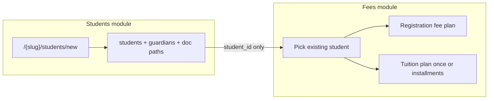

# Student registration (SIS, fees-safe)

Label: `wayfinder:map`  
Tracker: local markdown (`gh` is not installed on this machine; GitHub issues were not created).

## Destination

A written spec an agent can implement without growing Fees: SIS field list with required markers (`*`); who may `students.register`; parent-at-counter identity (Aadhaar default, driving licence, passport PDF — never child Aadhaar); optional photo and birth certificate in a private Supabase Storage bucket; how Fees later assigns a registration-fee plan and a tuition plan by existing `student_id`; cutover of `/{slug}/fees/register` so it stops inserting `students`.

Lock the spec first. Then implement SIS create only. Then retarget Fees. Slice 3 marks stay after SIS create works.

## Notes

- Domain: school-side student create on `/{slug}/students/new` in `features/student-dashboard`. Fees stays money-only after cutover.
- Skills: `ponytail`, `edubridge-erp-landscape`, `nextjs-supabase-auth`, `supabase-postgres-best-practices`. Storage uses `@supabase/ssr` (ADR-004); Drizzle still owns table rows.
- Standing: thin Fees create exists today (`registerStudentAction` on `/{slug}/fees/register`) and is the wrong home. `students.photo_url` exists and is unused. EduDatabase has **zero** Storage buckets. Coordinator cannot open `/students` (nav + `students.view` omit coordinator). RLS `students_write_admin_accountant` blocks coordinator INSERT.
- Ask before `pnpm db:generate` / `pnpm db:migrate`. Do not drop `student_fee_assignments_student_unique` in the SIS schema PR.
- Form stack is locked: native `FormData` + `useActionState` + Zod. Do not install React Hook Form for this form.
- Capability `students.register` is **not** `MONEY_ROLES`. Do not fold coordinator into accountant writes.

## Decisions so far

- [Where identity files live](./tickets/research-where-identity-files-live.md) — One private Files bucket `student-documents`; PDF + images; paths on tables, not bytes in Postgres.
- [Which form library](./tickets/research-form-library-student-registration.md) — Native `FormData` + `useActionState` + Zod. Add shadcn Field to `@repo/ui` when building. No RHF.
- [What PII we may store for Aadhaar](./tickets/research-aadhaar-pii.md) — Never store the 12-digit number (or last-4) in Postgres. File-only in private Storage. Not an AUA/KUA. Not legal advice.
- Surface is Students (`/{slug}/students/new`), not Fees. Accountant does not fill Aadhaar.
- Two modules, one link: after SIS ships, Fees selects an existing `student_id`. Fees never inserts `students` / `student_guardians` once SIS create exists.

## Not yet specified

- [Required vs optional field inventory](./tickets/grill-required-vs-optional-fields.md)
- [How delegated staff is granted register](./tickets/grill-delegated-staff-register.md)
- [Identity proof: type list and file vs number](./tickets/grill-identity-proof-type-and-file.md) — number storage is closed by Aadhaar research; types and whether a file is required remain HITL.
- Photo on the family hub after admission.
- Document replace after admission.
- Whether coordinator sees attendance on `/students` or only `/students/new`.

## Blocked (do not implement until open)

- [Student/guardian schema + `student_documents` paths](./tickets/grill-student-guardian-schema.md)
- [`students.register` capability + RLS split](./tickets/grill-students-register-capability-rls.md)
- [Fees assign-after-link + later dual-plan unique index](./tickets/grill-fees-assign-after-link.md)

## Out of scope

- Slice 3 marks / class CRUD / family charts (after SIS create)
- Enquiry pipeline, child Aadhaar, OCR, bulk CSV, UPI gateway
- AWS S3 as a second product
- Changing `student_fee_assignments` unique index in the SIS PR
- Building the form until the HITL tickets close
